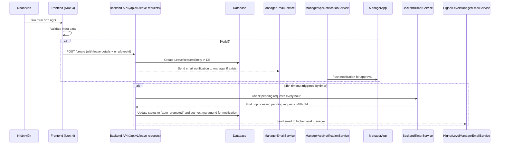
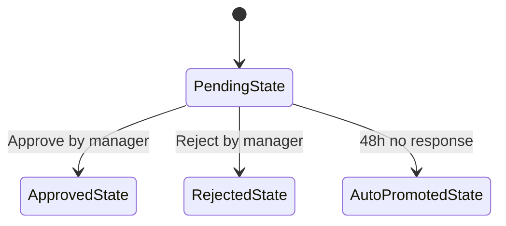
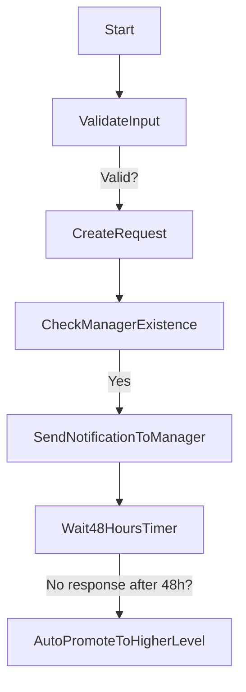
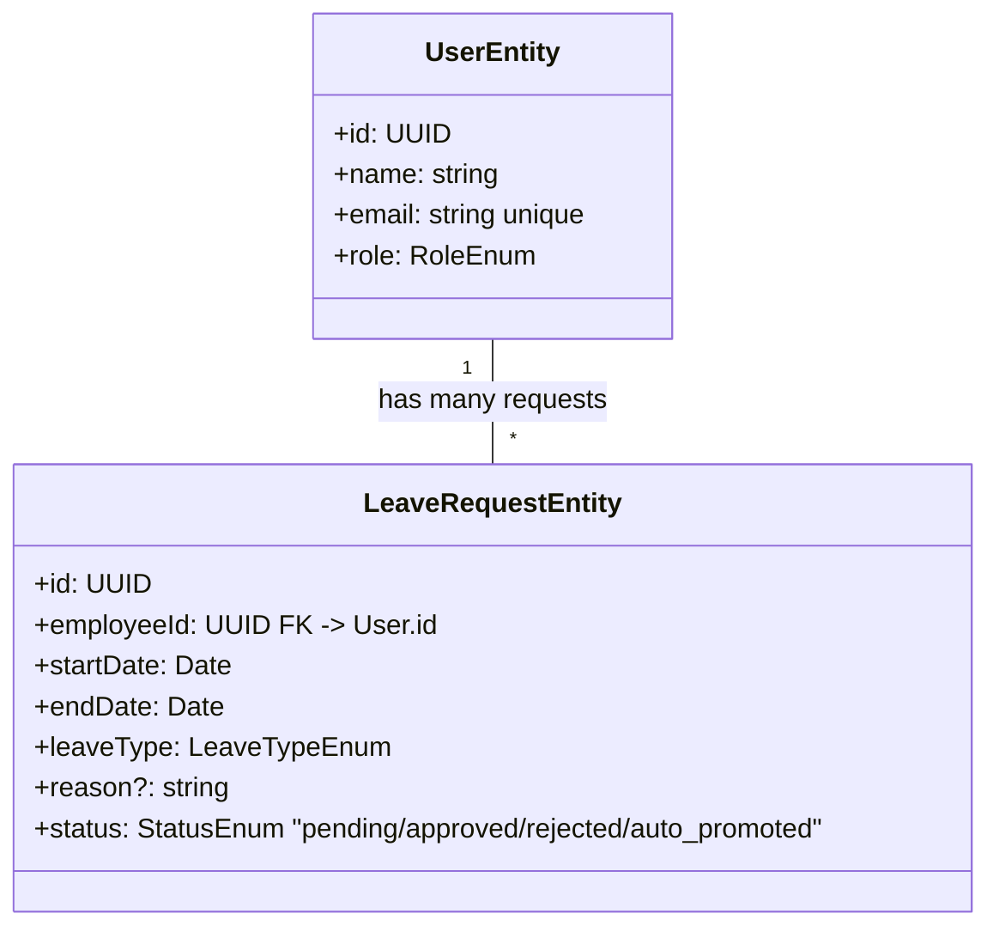

### TASK: Approve Leave Request System

### ENTITIES:
- UserEntity
- LeaveRequestEntity

### EXECUTES:
- SubmitLeaveRequest
- ApproveLeave
- RejectLeave
- AutoPromoteToHigherLevel

------------------------------------------

### MÔ TẢ: 
- Giải quyết vấn đề 1: Nhân viên có thể gửi đơn nghỉ phép trực tuyến.
- Giải quyết vấn đề 2: Quản lý cấp dưới duyệt/từ chối đơn và nhận thông báo ngay lập tức qua email/app.
- Giải quyết vấn đề 3: Nếu quản lý không phản hồi trong 48 giờ, hệ thống tự động đẩy đơn lên cấp cao hơn.

### TÁC NHÂN (ACTORS):
- Actor chính: Nhân viên (Employee)
- Actor phụ: Quản lý trực tiếp (Manager), HR/Administrator

### DỮ LIỆU ĐẦU VÀO (INPUT):
- Tên trường | Kiểu dữ liệu | Bắt buộc | Ghi chú
  - leaveType | string | Yêu cầu (e.g., "annual", "sick") |
  - startDate | date | Yêu cầu |
  - endDate | date | Yêu cầu (phải sau startDate) |
  - reason | string | Tùy chọn |

### QUY TRÌNH THỰC HIỆN (ACTIONS FLOW):
- Step 1: Nhân viên điền thông tin đơn nghỉ và gửi.
- Step 2: Hệ thống lưu đơn vào DB với trạng thái "pending".
- Step 3: Nếu quản lý trực tiếp tồn tại, hệ thống gửi email/app notification đến họ.
- Step 4: Quản lý phản hồi trong 48h (duyệt/từ chối) hoặc không có phản hồi.
- Step 5: Nếu không có phản hồi sau 48h → trạng thái "auto_promoted" và đẩy lên cấp cao hơn.

### QUY TẮC NGHIỆP VỤ (BUSINESS LOGIC):
- Logic 1: Khi nhân viên gửi đơn, hệ thống xác nhận quản lý trực tiếp của họ.
- Logic 2: Nếu có quản lý → gửi thông báo. Sau 48h nếu chưa có phản hồi → tự động nâng cấp trạng thái và thông báo lên cấp cao hơn.

### DỮ LIỆU ĐẦU RA (OUTPUT):
- Trạng thái: Thành công (đơn được tạo) / Thất bại (lỗi validation)
- Dữ liệu trả về: ID đơn nghỉ, thông tin cập nhật

---

1. Decision Table:
* Condition: Nhân viên gửi đơn nghỉ
  - Case 1: Quản lý trực tiếp tồn tại và phản hồi trong 48h → trạng thái được cập nhật thành "approved" hoặc "rejected".
  - Case 2: Quản lý không phản hồi sau 48h → trạng thái tự động chuyển thành "auto_promoted", thông báo lên cấp cao hơn.
  - Case 3: Nhân viên là quản lý/administrator (không có cấp trên) → không áp dụng quy tắc auto-promote.

---

2. Acceptance Criteria:
* [GIVEN] Một nhân viên gửi đơn nghỉ phép hợp lệ,
  [WHEN] Hệ thống xử lý yêu cầu,
  [THEN] Đơn được tạo với trạng thái "pending" và quản lý trực tiếp nhận thông báo qua email/app.
* [GIVEN] Quản lý duyệt/từ chối đơn trong vòng 48 giờ,
  [WHEN] Họ thực hiện hành động,
  [THEN] Trạng thái của đơn được cập nhật thành tương ứng ("approved"/"rejected") và hệ thống không tự động nâng cấp.
* [GIVEN] Nhân viên gửi đơn, quản lý trực tiếp không phản hồi sau 48 giờ,
  [WHEN] Hệ thống kích hoạt timer,
  [THEN] Trạng thái đơn chuyển thành "auto_promoted", thông báo được gửi đến quản lý cấp cao hơn và trạng thái cập nhật.

---

3. Domain Model (Entity Mapping - Mô hình dữ liệu)
* <UserEntity>:
  - id: UUID | unique
    #description: Primary key, unique identifier for user.
  - name: string | required
    #description: Full name of the employee/manager.
  - email: string | unique
    #description: Email address used for notifications and authentication. Must be unique across all users.
  - role: RoleEnum (employee/manager/admin)
    #description: User's role in organization, determines permissions and hierarchy relationships.

* <LeaveRequestEntity>:
  - id: UUID | unique
    #description: Unique identifier for leave request record.
  - employeeId: UUID | FK → User.id
    #description: Foreign key linking the request to its submitter (employee).
  - startDate: Date | required
    #description: Start date of the leave period, must be in valid format and not before current date/time.
  - endDate: Date | required
    #description: End date of the leave period, must be after startDate.
  - leaveType: LeaveTypeEnum (annual/sick/vacation)
    #description: Type of leave being requested (e.g., annual vacation or sick day).
  - reason: string | optional
    #description: Optional description provided by employee for their request.
  - status: StatusEnum (pending/approved/rejected/auto_promoted) | default "pending"
    #description: Current state of the leave request, determines workflow and notification triggers.

* Relationship:
  UserEntity has many LeaveRequestEntity (1:N), where each request is associated with a single employee.

---

4. Test Case Specification:

* TC1 - Successful submission by employee
  * Input:
    - Valid leave details (e.g., annual from 2024-01-15 to 2024-01-19, reason "Family trip").
  * Expected Output:
    - LeaveRequestEntity created with status "pending".
    - Manager notification sent via email/app.
  * Edge Case:
    - Invalid date range (endDate < startDate) → validation fails, request not created.

* TC2 - Manual approval by manager
  * Input:
    - Manager approves pending leave request using UI button.
  * Expected Output:
    - Status updated to "approved".
    - No auto-promotion triggered since manual action occurred within timeframe.
  * Edge Case:
    - Approving after 48h → still valid (manual override), status updates.

* TC3 - Auto promotion due to no response
  * Input:
    - Employee submits leave, manager never responds for >48 hours.
  * Expected Output:
    - Status changes from "pending" to "auto_promoted".
    - Notification sent to next higher-level manager.
  * Edge Case:
    - Top-level admin (no hierarchy) → no auto-promotion applied.

---

### UML & FLOW DIAGRAM

1. Sequence Diagram (Mermaid.js):

2. State Diagram (Mermaid.js):

3. Flowchart (Mermaid.js - graph TD):

4. Class Diagram (Mermaid.js):

---

### </> ÁNH XẠ KỸ THUẬT (TECHNICAL MAPPING)

#### Schemas:
1. shared/types/user.schema.ts
* Giải quyết: Định nghĩa schema cho UserEntity.
* Validate: Email uniqueness, role enum validation.
* Dùng cho: API request/response for user management.

2. shared/types/leave-request.schema.ts
* Giải quyết: Schema cho LeaveRequestEntity với các trường cần validate.
* Validate: Date range (endDate > startDate), required fields check.
* Dùng cho: API endpoints handling leave requests and UI form validation.

#### Types:
1. shared/types/user.type.ts
* Định nghĩa: Enum types for role (employee/manager/admin) and status (pending/approved/rejected/auto_promoted).
* Dùng cho: Type safety in components/composables/backend logic.

2. shared/types/leave-request.type.ts
* Định nghĩa: Types for LeaveRequestEntity fields with proper TypeScript definitions.
* Dùng cho: Frontend state management, API request/response types.

#### Utils:
1. shared/utils/check-date-range.ts
* Xử lý: Validate startDate and endDate logic (endDate must be after start date).
* Tái sử dụng: For both frontend form validation and backend endpoint validation.

2. shared/utils/get-hierarchy-manager.ts
* Xử lý: Retrieve next higher-level manager based on current user's role/managerId.
* Tái sử dụng: In composables for auto-promotion logic and notification routing.

#### API:
1. server/api/v1/leave-requests/create.[post].ts
* Xử lý: Create new leave request in database, check if direct manager exists to trigger notifications.
* Input: LeaveRequestSchema + employeeId.
* Output: Created LeaveRequestEntity with status "pending".

2. server/api/v1/leave-requests/[id]/approve.[patch].ts
* Xử lý: Update request status to "approved" and send notification to next level if needed.
* Input: Request body { action: 'approve' } + optional managerId for promotion logic.
* Output: Updated LeaveRequestEntity.

3. server/api/v1/leave-requests/[id]/reject.[patch].ts
* Xử lý: Update status to "rejected".
* Input: Action payload.
* Output: Status updated entity.

#### Components:
1. app/components/business/FormLeaveRequest.vue
* Vai trò: Business UI component for submitting leave request form.
* Dùng cho: Main view page where employees submit new requests.

2. app/components/ui/KitInput.vue, KitButtonGroup.vue
* Vai trò: UI kits for common controls (inputs/buttons).
* Dùng cho: Reusable across forms and other components in the system.

3. app/pages/ViewLeaveRequests.vue
* Route: /leave-requests.
* Chức năng: Display list of leave requests with status, approval actions.

#### Composables:
1. app/composables/useSubmitLeave.ts
* Xử lý: Manages state for leave request form (validation, API calls), handles success/error states.
* State: Form data, loading state, error messages.
* API call: Submit request to backend endpoint and handle notifications.

2. app/composables/useNotificationManager.ts
* Xử lý: Centralized logic for sending email/app notifications based on user roles and actions.
* State: Notification queue, status tracking.
* Reusable: Across different modules (leave requests, approvals).