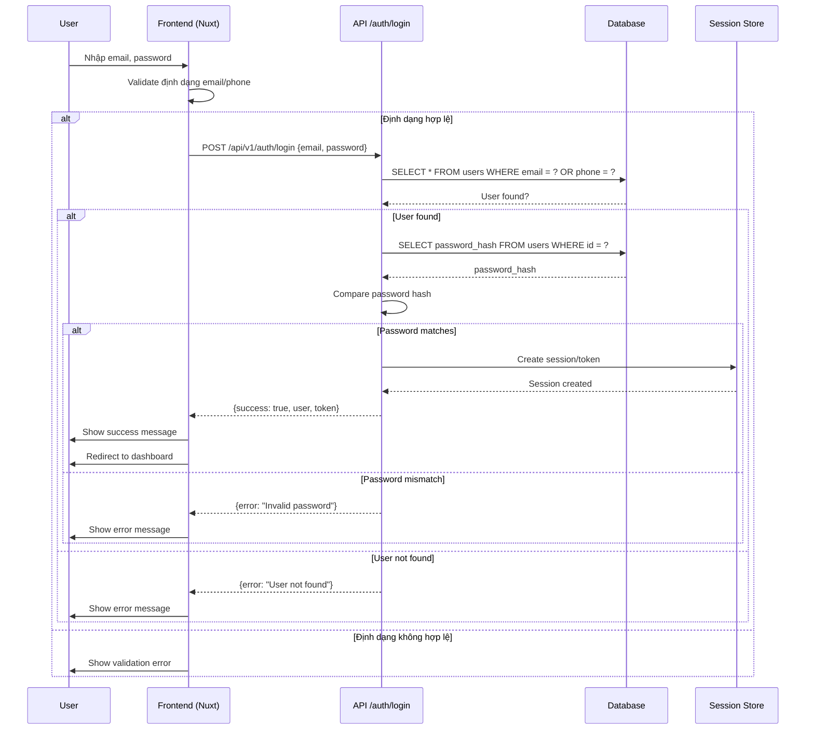
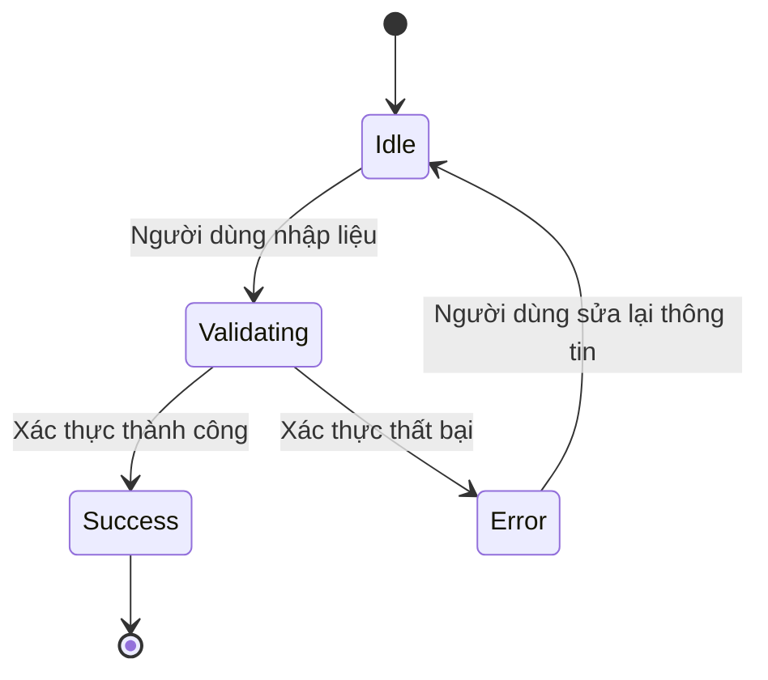
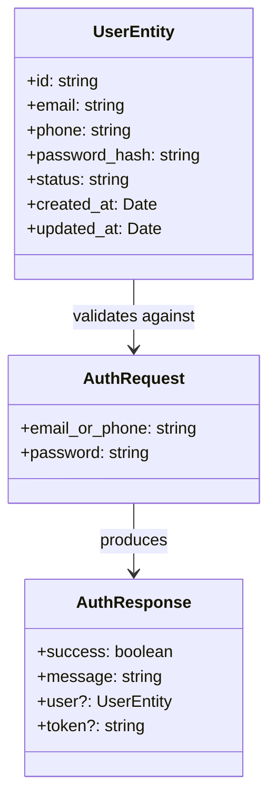

TASK: Đăng nhập người dùng

ENTIES: UserEntity

EXECUTES: đăng nhập

------------------------------------------

### MÔ TẢ: 
- Xác thực người dùng qua email/số điện thoại và mật khẩu
- Tạo phiên làm việc (session) sau khi xác thực thành công
- Xử lý các trường hợp lỗi: tài khoản không tồn tại, mật khẩu sai, tài khoản bị khóa

------------------------------------------

### TÁC NHÂN (ACTORS):

- Actor chính: User (người dùng đăng nhập)
- Actor phụ: System (hệ thống xác thực)

------------------------------------------

### DỮ LIỆU ĐẦU VÀO (INPUT):

| Tên trường | Kiểu dữ liệu | Bắt buộc | Ghi chú |
|------------|--------------|----------|---------|
| email/phone | string | Có | Email hoặc số điện thoại |
| password | string | Có | Mật khẩu người dùng |
| remember_me | boolean | Không | Ghi nhớ đăng nhập (optional) |

------------------------------------------

### QUY TRÌNH THỰC HIỆN (ACTIONS FLOW):

- Step 1: Người dùng nhập email/số điện thoại và mật khẩu vào form
- Step 2: Hệ thống validate định dạng email/số điện thoại
- Step 3: Gửi yêu cầu xác thực đến API /api/v1/auth/login
- Step 4: Backend kiểm tra tài khoản tồn tại trong database
- Step 5: Nếu tồn tại, kiểm tra mật khẩu (hash compare)
- Step 6: Nếu mật khẩu đúng, tạo session/token và trả về thông tin user
- Step 7: Frontend nhận response, lưu token vào cookie/localStorage
- Step 8: Redirect người dùng đến trang dashboard

------------------------------------------

### QUY TẮC NGHIỆP VỤ (BUSINESS LOGIC):

- Logic 1: Nếu email/số điện thoại không tồn tại → trả về lỗi "Tài khoản không tồn tại"
- Logic 2: Nếu mật khẩu không khớp → trả về lỗi "Mật khẩu không chính xác"
- Logic 3: Nếu tài khoản bị khóa/banned → trả về lỗi "Tài khoản đã bị vô hiệu hóa"
- Logic 4: Nếu đăng nhập thành công → tạo session với TTL 24h (hoặc theo cấu hình)

------------------------------------------

### DỮ LIỆU ĐẦU RA (OUTPUT):

- Trạng thái: Thành công / Thất bại
- Dữ liệu trả về: { success: boolean, message: string, user?: UserEntity, token?: string }

------------------------------------------

### BUSINESS ANALYSIS STANDARDS

1. Decision Table:

* Condition: Email/Phone tồn tại và mật khẩu đúng
  - Case 1: Tài khoản hoạt động → Tạo session, redirect dashboard
* Condition: Email/Phone không tồn tại
  - Case 2: Hiển thị lỗi "Tài khoản không tìm thấy"
* Condition: Mật khẩu sai
  - Case 3: Hiển thị lỗi "Mật khẩu không chính xác"
* Condition: Tài khoản bị khóa/banned
  - Case 4: Hiển thị lỗi "Tài khoản đã bị vô hiệu hóa"

---

2. Acceptance Criteria:

* [GIVEN] Người dùng nhập email và mật khẩu đúng [WHEN] Nhấn nút đăng nhập [THEN] Redirect đến trang dashboard với thông báo thành công
* [GIVEN] Người dùng nhập email và mật khẩu sai [WHEN] Nhấn nút đăng nhập [THEN] Hiển thị thông báo lỗi, không redirect
* [GIVEN] Người dùng nhập email không tồn tại [WHEN] Nhấn nút đăng nhập [THEN] Hiển thị lỗi "Tài khoản không tìm thấy"
* [GIVEN] Tài khoản bị khóa [WHEN] Nhập đúng mật khẩu [THEN] Hiển thị lỗi "Tài khoản đã bị vô hiệu hóa"

---

3. Domain Model (Entity Mapping - Mô hình dữ liệu)

* UserEntity:

  - id: string (UUID)
  - email: string
  - phone: string
  - password_hash: string
  - status: 'active' | 'locked' | 'banned'
  - created_at: Date
  - updated_at: Date

---

4. Test Case Specification:

* TC1:

  * Input: email="user@example.com", password="correct123"
  * Expected Output: Redirect to dashboard, show success message
  * Edge Case: Network timeout → Show loading state, retry after 3s

* TC2:

  * Input: email="nonexistent@example.com", password="any"
  * Expected Output: Error message "Tài khoản không tìm thấy"
  * Edge Case: Email format invalid → Show validation error before API call

---

### UML & FLOW DIAGRAM

1. Sequence Diagram (Mermaid.js):



---

2. State Diagram (Mermaid.js):



---

3. Flowchart (Mermaid.js - graph TD):

```mermaid
graph TD
    A[Start] --> B{Email/Phone format valid?}
    B--No--> C[Show validation error]
    C --> A
    B--Yes--> D{User exists?}
    D--No--> E[Show "User not found"]
    E --> A
    D--Yes--> F{Password matches?}
    F--No--> G[Show "Invalid password"]
    G --> A
    F--Yes--> H{Account status?}
    H--Locked/Banned--> I[Show "Account disabled"]
    I --> A
    H--Active--> J[Create session]
    J --> K[Redirect to dashboard]
```

---

4. Class Diagram (Mermaid.js):



---

### </> ÁNH XẠ KỸ THUẬT (TECHNICAL MAPPING):

#### Schemas:

1. shared/types/Auth.schema.ts

* Giải quyết: Validate input email/phone và password
* Validate: Zod schema cho login request/response
* Dùng cho: Form validation, API payload validation

---

#### Types:

1. shared/types/Auth.types.ts

* Định nghĩa: UserEntity, AuthRequest, AuthResponse interfaces
* Dùng cho: Type safety trong components và composables

---

#### Utils:

1. shared/utils/auth.utils.ts

* Xử lý: Hash password compare, generate token/session
* Tái sử dụng: Hàm validateEmail, formatPhone trong toàn app

---

#### API:

1. server/api/v1/auth/login.post.ts

* Xử lý: Xác thực user, tạo session
* Input: { email_or_phone: string, password: string }
* Output: { success: boolean, message: string, user?: UserEntity, token?: string }

---

#### Components:

1. app/components/forms/FormLogin.vue

* Vai trò: UI form đăng nhập với email/phone và password
* Dùng cho: Page /auth/login

2. app/components/popups/PopAlert.vue

* Vai trò: Hiển thị thông báo lỗi/thành công
* Dùng cho: Feedback sau khi submit form

---

#### Composables:

1. app/composables/useAuth.ts

* Xử lý: Handle login logic, store token/session
* State: isLoading, error, user
* API call: POST /api/v1/auth/login

---

#### Pages:

1. app/pages/auth/login.vue

* Route: /auth/login
* Chức năng: Trang đăng nhập chính