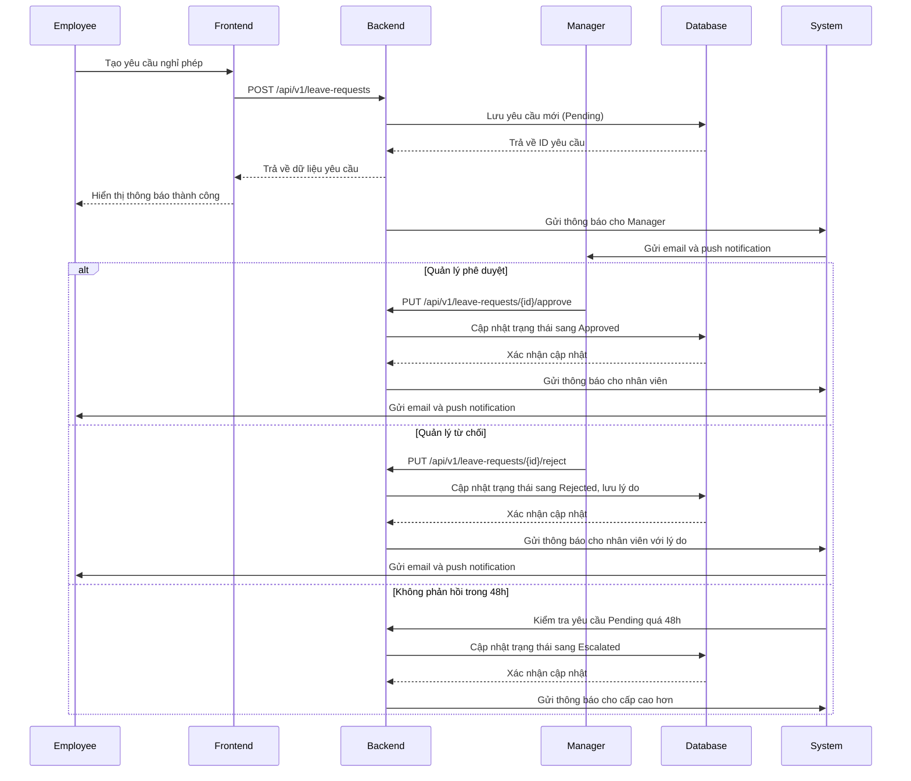
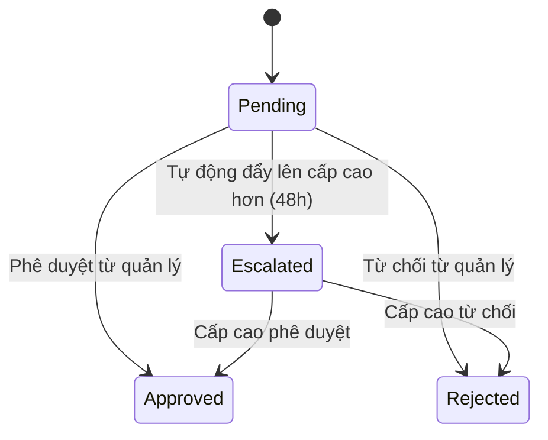
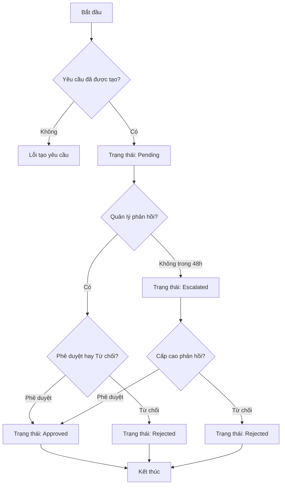
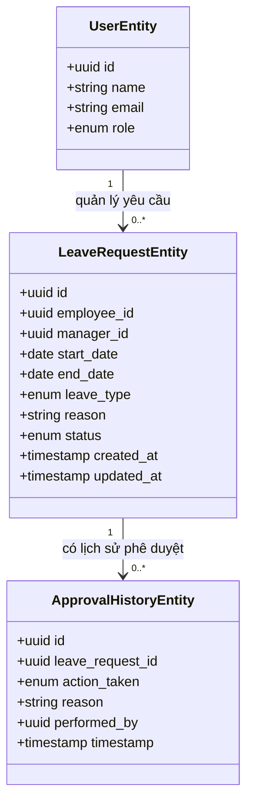

TASK: Hệ thống phê duyệt yêu cầu nghỉ phép

ENTITIES: LeaveRequestEntity, UserEntity, ApprovalHistoryEntity

EXECUTES: submitLeaveRequest, approveLeaveRequest, rejectLeaveRequest, escalateLeaveRequest

------------------------------------------

### MÔ TẢ: 
- Xử lý luồng nghiệp vụ từ khi nhân viên gửi đơn nghỉ phép đến khi được phê duyệt hoặc từ chối
- Tự động đẩy yêu cầu lên cấp cao hơn nếu quản lý không phản hồi trong 48h
- Gửi thông báo qua email và ứng dụng cho các bên liên quan

------------------------------------------

### TÁC NHÂN (ACTORS):

- Actor chính: Nhân viên (Employee)
- Actor phụ: Quản lý trực tiếp (Manager), Hệ thống tự động hóa (System)

### DỮ LIỆU ĐẦU VÀO (INPUT):

- leave_type | enum | Bắt buộc | Loại nghỉ phép (Bệnh, Nghỉ phép, Nghỉ việc riêng...)
- start_date | date | Bắt buộc | Ngày bắt đầu nghỉ
- end_date | date | Bắt buộc | Ngày kết thúc nghỉ
- reason | string | Bắt buộc | Lý do nghỉ phép
- manager_id | uuid | Bắt buộc | ID quản lý trực tiếp

### QUY TRÌNH THỰC HIỆN (ACTIONS FLOW):

- Step 1: Nhân viên tạo yêu cầu nghỉ phép với đầy đủ thông tin
- Step 2: Hệ thống lưu yêu cầu vào cơ sở dữ liệu với trạng thái "Pending"
- Step 3: Gửi thông báo qua email và app cho quản lý trực tiếp
- Step 4: Quản lý xem xét và phê duyệt hoặc từ chối yêu cầu
- Step 5: Nếu phê duyệt -> cập nhật trạng thái sang "Approved", gửi thông báo cho nhân viên
- Step 6: Nếu từ chối -> cập nhật trạng thái sang "Rejected", lưu lý do, gửi thông báo cho nhân viên
- Step 7: Hệ thống kiểm tra định kỳ mỗi 48h nếu yêu cầu vẫn ở trạng thái "Pending"
- Step 8: Nếu quá 48h không có phản hồi -> tự động đẩy lên cấp cao hơn, cập nhật trạng thái sang "Escalated"

### QUY TẮC NGHIỆP VỤ (BUSINESS LOGIC):

- Logic 1: Nếu quản lý phê duyệt -> trạng thái chuyển sang "Approved", lưu lại vào ApprovalHistoryEntity
- Logic 2: Nếu quản lý từ chối -> trạng thái chuyển sang "Rejected", lưu lý do từ chối vào ApprovalHistoryEntity
- Logic 3: Nếu yêu cầu ở trạng thái "Pending" quá 48h mà không có hành động nào -> tự động chuyển sang "Escalated" và gửi thông báo cho cấp cao hơn

### DỮ LIỆU ĐẦU RA (OUTPUT):

- Trạng thái: Thành công / Thất bại
- Dữ liệu trả về: ID yêu cầu, trạng thái mới, thời gian xử lý, thông báo đã gửi

### BUSINESS ANALYSIS STANDARDS

1. Decision Table:

* Condition: Thời gian phản hồi của quản lý
- Case 1: Phản hồi trong 48h -> Phê duyệt hoặc Từ chối
- Case 2: Không phản hồi sau 48h -> Tự động đẩy lên cấp cao hơn

---

2. Acceptance Criteria:

* [GIVEN] Yêu cầu nghỉ phép ở trạng thái Pending [WHEN] Quản lý phê duyệt [THEN] Trạng thái chuyển sang Approved và gửi thông báo cho nhân viên
* [GIVEN] Yêu cầu nghỉ phép ở trạng thái Pending [WHEN] Quản lý từ chối [THEN] Trạng thái chuyển sang Rejected, lưu lý do và gửi thông báo cho nhân viên
* [GIVEN] Yêu cầu nghỉ phép ở trạng thái Pending [WHEN] Quá 48h không có phản hồi [THEN] Trạng thái tự động chuyển sang Escalated và gửi thông báo cho cấp cao hơn

---

3. Domain Model (Entity Mapping - Mô hình dữ liệu)

* LeaveRequestEntity:

  - id: uuid
  - employee_id: uuid
  - manager_id: uuid
  - start_date: date
  - end_date: date
  - leave_type: enum
  - reason: string
  - status: enum (Pending, Approved, Rejected, Escalated)
  - created_at: timestamp
  - updated_at: timestamp

* UserEntity:

  - id: uuid
  - name: string
  - email: string
  - role: enum (Employee, Manager)

* ApprovalHistoryEntity:

  - id: uuid
  - leave_request_id: uuid
  - action_taken: enum (Approved, Rejected, Escalated)
  - reason: string
  - performed_by: uuid
  - timestamp: timestamp

---

4. Test Case Specification:

* TC1:

  * Input: leave_type="Bệnh", start_date="2024-01-01", end_date="2024-01-05", reason="Sốt cao"
  * Expected Output: Yêu cầu được tạo thành công với trạng thái Pending
  * Edge Case: Ngày kết thúc nhỏ hơn ngày bắt đầu -> Lỗi validation

* TC2:

  * Input: leave_request_id="xxx", action="approve"
  * Expected Output: Trạng thái chuyển sang Approved, thông báo gửi thành công
  * Edge Case: Quản lý không có quyền phê duyệt -> Lỗi permission

* TC3:

  * Input: leave_request_id="xxx", action="reject", reason="Không đủ nhân sự"
  * Expected Output: Trạng thái chuyển sang Rejected, lưu lý do vào lịch sử
  * Edge Case: Lý do từ chối quá dài (>500 ký tự) -> Cắt bớt hoặc lỗi validation

---

### UML & FLOW DIAGRAM

1. Sequence Diagram (Mermaid.js):

---

2. State Diagram (Mermaid.js):

---

3. Flowchart (Mermaid.js - graph TD):

---

4. Class Diagram (Mermaid.js):

---

### </> ÁNH XẠ KỸ THUẬT (TECHNICAL MAPPING):

#### Schemas:

1. shared/types/leave-request.schema.ts

* Giải quyết: Validate dữ liệu yêu cầu nghỉ phép
* Validate: Kiểm tra ngày bắt đầu/kết thúc hợp lệ, lý do không rỗng, loại nghỉ phép hợp lệ
* Dùng cho: API input validation, form submission

---

#### Types:

1. shared/types/leave-request.ts

* Định nghĩa: Interface LeaveRequest, LeaveRequestStatus enum
* Dùng cho: Type safety trong code frontend và backend

---

#### Utils:

1. shared/utils/date-utils.ts

* Xử lý: Tính toán thời gian 48h, so sánh ngày tháng
* Tái sử dụng: Hàm checkIsOverdue, calculateTimeRemaining

---

#### API:

1. server/api/v1/leave-requests/index.post.ts

* Xử lý: Tạo yêu cầu nghỉ phép mới
* Input: LeaveRequest schema
* Output: LeaveRequestEntity với status Pending

2. server/api/v1/leave-requests/{id}.get.ts

* Xử lý: Lấy chi tiết yêu cầu nghỉ phép
* Input: ID yêu cầu
* Output: LeaveRequestEntity + ApprovalHistoryEntity

3. server/api/v1/leave-requests/{id}/approve.put.ts

* Xử lý: Phê duyệt yêu cầu nghỉ phép
* Input: ID yêu cầu, user_id (quản lý)
* Output: LeaveRequestEntity với status Approved

4. server/api/v1/leave-requests/{id}/reject.put.ts

* Xử lý: Từ chối yêu cầu nghỉ phép
* Input: ID yêu cầu, user_id (quản lý), reason
* Output: LeaveRequestEntity với status Rejected

5. server/api/v1/leave-requests/check-escalation.get.ts

* Xử lý: Kiểm tra yêu cầu nào cần tự động đẩy lên cấp cao hơn
* Input: Không có (GET endpoint)
* Output: List của LeaveRequestEntity cần xử lý

---

#### Components:

1. app/components/ui/KitInput.vue

* Vai trò: UI input thuần với validation
* Dùng cho: Form nhập liệu ngày, lý do, loại nghỉ phép

2. app/components/business/ViewLeaveRequests.vue

* Vai trò: Business UI hiển thị danh sách yêu cầu nghỉ phép
* Xử lý: Lọc theo trạng thái, tìm kiếm, phân trang

---

#### Composables:

1. app/composables/useLeaveRequest.ts

* Xử lý: Logic nghiệp vụ cho yêu cầu nghỉ phép (submit, approve, reject)
* State: leaveRequests (list), currentRequest (active request)
* API call: useLeaveRequestAPI() để gọi các endpoint API

---

#### Pages:

1. app/pages/leave-requests.vue

* Route: /leave-requests
* Chức năng: Danh sách yêu cầu nghỉ phép, có filter theo trạng thái

2. app/pages/leave-requests/new.vue

* Route: /leave-requests/new
* Chức năng: Form tạo yêu cầu nghỉ phép mới

---

#### Middleware:

1. app/middleware/auth.ts

* Mục đích: Kiểm tra quyền truy cập (chỉ quản lý mới được approve/reject)
* Áp dụng: Các route API phê duyệt, từ chối