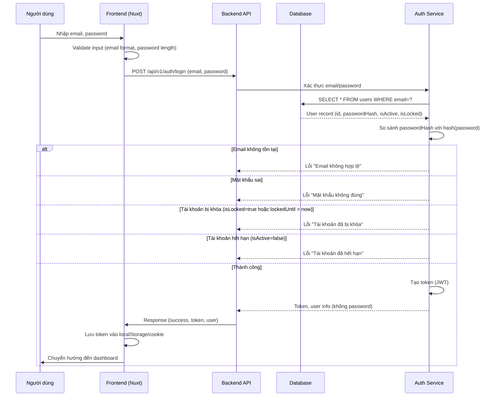
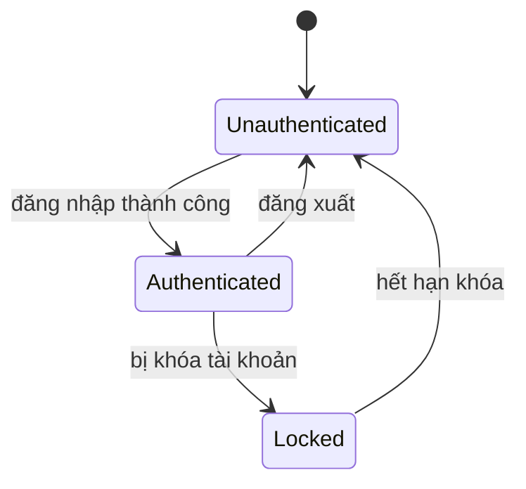
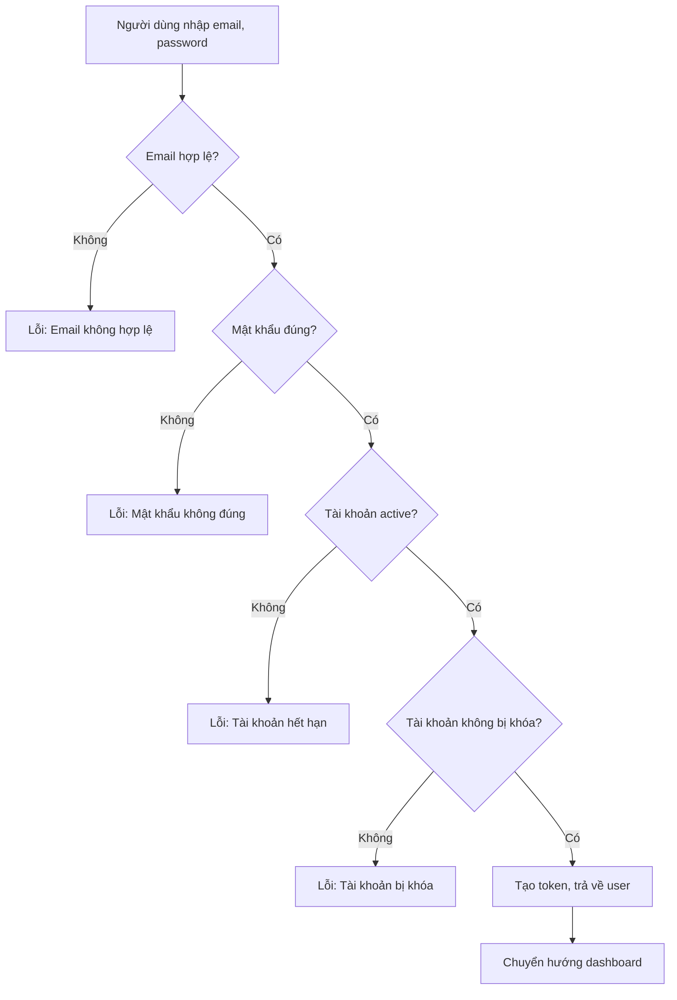
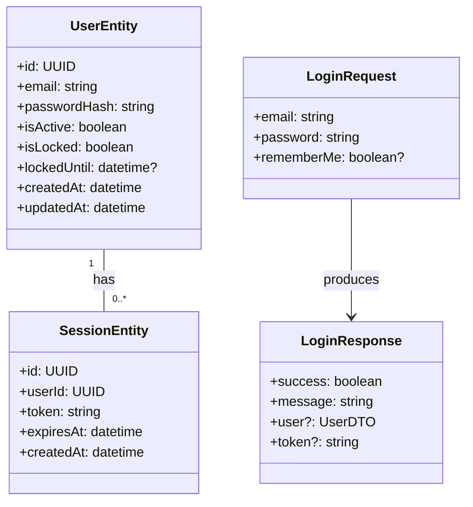

### TASK: Đăng nhập (Login)

### ENTITIES:
- UserEntity
- SessionEntity (optional, for token management)

### EXECUTES:
- đăng nhập
- xác thực tài khoản
- tạo phiên làm việc

------------------------------------------

### MÔ TẢ: 
- Giải quyết vấn đề 1: Cho phép người dùng truy cập hệ thống bằng cách xác thực thông tin đăng nhập (email/tên đăng nhập và mật khẩu).
- Giải quyết vấn đề 2: Bảo vệ tài khoản khỏi truy cập trái phép bằng cách kiểm tra mật khẩu, trạng thái khóa tài khoản, và yêu cầu xác thực hai yếu tố (nếu cấu hình).

------------------------------------------

### TÁC NHÂN (ACTORS):
- Actor chính: Người dùng (User)
- Actor phụ: Hệ thống quản lý phiên (Session Manager), hệ thống bảo mật (Security Service)

------------------------------------------

### DỮ LIỆU ĐẦU VÀO (INPUT):
- Tên trường | Kiểu dữ liệu | Bắt buộc | Ghi chú
- email/tên đăng nhập | string | bắt buộc | không trùng, độ dài 3-50 ký tự
- password | string | bắt buộc | độ dài tối thiểu 8 ký tự, có chữ hoa, chữ thường, số, ký tự đặc biệt
- rememberMe (optional) | boolean | không bắt buộc | lưu cookie session

------------------------------------------

### QUY TRÌNH THỰC HIỆN (ACTIONS FLOW):
- Step 1: Người dùng nhập email và mật khẩu vào form đăng nhập.
- Step 2: Frontend validate input (email format, password length, required fields).
- Step 3: Frontend gửi yêu cầu POST /api/v1/auth/login với payload { email, password, rememberMe }.
- Step 4: Backend xác thực email và mật khẩu (hash compare), kiểm tra trạng thái tài khoản (active, locked, expired).
- Step 5: Nếu thành công, tạo session token (JWT hoặc server-side session) và trả về thông tin người dùng (không trả về password).
- Step 6: Frontend nhận response, lưu token vào localStorage/cookie, chuyển hướng đến trang dashboard.

------------------------------------------

### QUY TẮC NGHIỆP VỤ (BUSINESS LOGIC):
- Logic 1: Nếu email không tồn tại → trả về lỗi "Email không hợp lệ".
- Logic 2: Nếu mật khẩu sai → trả về lỗi "Mật khẩu không đúng".
- Logic 3: Nếu tài khoản bị khóa (do nhiều lần đăng nhập thất bại) → trả về lỗi "Tài khoản đã bị khóa, vui lòng liên hệ quản trị viên".
- Logic 4: Nếu tài khoản hết hạn → trả về lỗi "Tài khoản đã hết hạn".
- Logic 5: Nếu rememberMe = true → lưu cookie session với thời gian sống dài hơn (7 ngày).

------------------------------------------

### DỮ LIỆU ĐẦU RA (OUTPUT):
- Trạng thái: Thành công / Thất bại
- Dữ liệu trả về: { success: boolean, message: string, user?: UserDTO, token?: string }

------------------------------------------

### BUSINESS ANALYSIS STANDARDS

1. Decision Table:

* Condition: Email tồn tại? Mật khẩu đúng? Tài khoản active?
- Case 1: Email tồn tại, mật khẩu đúng, active → thành công.
- Case 2: Email không tồn tại → thất bại (email không hợp lệ).
- Case 3: Mật khẩu sai → thất bại (mật khẩu không đúng).
- Case 4: Tài khoản bị khóa → thất bại (tài khoản đã bị khóa).
- Case 5: Tài khoản hết hạn → thất bại (tài khoản đã hết hạn).

---

2. Acceptance Criteria:

* [GIVEN] Người dùng nhập email và mật khẩu hợp lệ, tài khoản tồn tại và active. [WHEN] người dùng nhấn nút đăng nhập. [THEN] hệ thống trả về token và chuyển hướng đến trang dashboard.
* [GIVEN] Người dùng nhập email không tồn tại. [WHEN] người dùng nhấn nút đăng nhập. [THEN] hệ thống hiển thị lỗi "Email không hợp lệ".
* [GIVEN] Người dùng nhập mật khẩu sai. [WHEN] người dùng nhấn nút đăng nhập. [THEN] hệ thống hiển thị lỗi "Mật khẩu không đúng".
* [GIVEN] Tài khoản bị khóa do nhiều lần đăng nhập thất bại. [WHEN] người dùng thử đăng nhập. [THEN] hệ thống hiển thị lỗi "Tài khoản đã bị khóa, vui lòng liên hệ quản trị viên".

---

3. Domain Model (Entity Mapping - Mô hình dữ liệu)

* UserEntity:
  - id: UUID | unique | FK → SessionEntity.userId (nếu có)
  - email: string | unique | không null | độ dài 3-50 ký tự | dùng để xác thực đăng nhập
  - passwordHash: string | không null | độ dài ~60 ký tự (bcrypt) | dùng để so sánh mật khẩu
  - isActive: boolean | không null | true/false | trạng thái tài khoản
  - isLocked: boolean | không null | true/false | trạng thái khóa tài khoản
  - lockedUntil: datetime | nullable | thời điểm hết khóa
  - createdAt: datetime | không null
  - updatedAt: datetime | không null
- SessionEntity (optional):
  - id: UUID | unique
  - userId: UUID | FK → UserEntity.id
  - token: string | không null | JWT hoặc session ID
  - expiresAt: datetime | không null
  - createdAt: datetime | không null

---

4. Test Case Specification:

* TC1:
  * Input: email="user@example.com", password="CorrectPassword123!", rememberMe=false
  * Expected Output: success=true, message="Đăng nhập thành công", user={id, email, name}, token="eyJhbG..."
  * Edge Case: Tài khoản chưa tồn tại → lỗi "Email không hợp lệ".

* TC2:
  * Input: email="user@example.com", password="WrongPassword"
  * Expected Output: success=false, message="Mật khẩu không đúng"
  * Edge Case: Mật khẩu sai nhiều lần → tài khoản bị khóa.

* TC3:
  * Input: email="locked@example.com", password="CorrectPassword123!"
  * Expected Output: success=false, message="Tài khoản đã bị khóa, vui lòng liên hệ quản trị viên"
  * Edge Case: lockedUntil trong tương lai → vẫn bị khóa.

---

### UML & FLOW DIAGRAM

1. Sequence Diagram (Mermaid.js):

---

2. State Diagram (Mermaid.js):

---

3. Flowchart (Mermaid.js - graph TD):

---

4. Class Diagram (Mermaid.js):

---

### </> ÁNH XẠ KỸ THUẬT (TECHNICAL MAPPING):

#### Schemas:

1. shared/types/auth.schema.ts

* Giải quyết: Xác thực yêu cầu đăng nhập và phản hồi.
* Validate: email format, password length, required fields.
* Dùng cho: Zod validation trong API endpoint và frontend form.

---

#### Types:

1. shared/types/auth.ts

* Định nghĩa: UserDTO, LoginRequest, LoginResponse, AuthError.
* Dùng cho: TypeScript interfaces cho API response và component props.

---

#### Utils:

1. shared/utils/auth.ts

* Xử lý: Hash password (bcrypt), verify password, generate JWT token, decode token.
* Tái sử dụng: Hàm hashPassword, verifyPassword, createToken, decodeToken.

---

#### API:

1. server/api/v1/auth/login.post.ts

* Xử lý: Nhận email/password, validate schema, xác thực user, tạo token, trả về response.
* Input: { email, password, rememberMe }
* Output: { success: boolean, message: string, user?: UserDTO, token?: string }

---

#### Components:

1. app/components/forms/FormLogin.vue

* Vai trò: Form đăng nhập với email/password và checkbox rememberMe.
* Dùng cho: Trang đăng nhập (app/pages/login.vue).

2. app/components/popups/PopAlert.vue

* Vai trò: Hiển thị thông báo lỗi thành công.
* Dùng cho: Hiển thị message từ API response.

---

#### Composables:

1. app/composables/useAuth.ts

* Xử lý: Gọi API login, xử lý token, lưu vào localStorage/cookie, logout.
* State: user, token, isAuthenticated.
* API call: POST /api/v1/auth/login.

---

#### Pages:

1. app/pages/login.vue

* Route: /login
* Chức năng: Hiển thị form đăng nhập, gọi useAuth để xử lý submit.

---

#### Middleware:

1. app/middleware/auth.ts

* Mục đích: Kiểm tra token trong request, nếu không có hoặc hết hạn → redirect đến /login.
* Áp dụng: Tất cả các route trừ /login và /register.