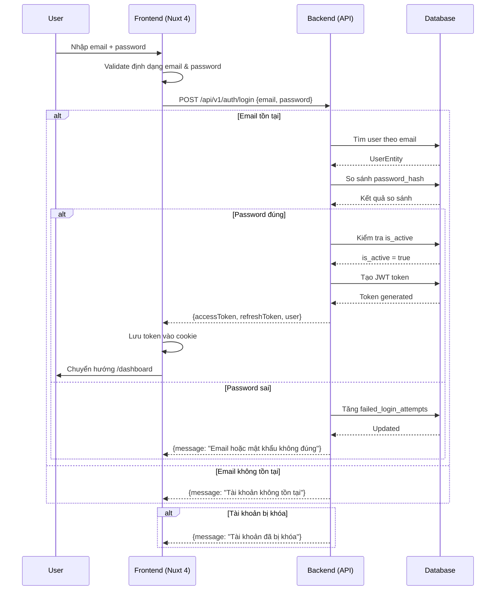
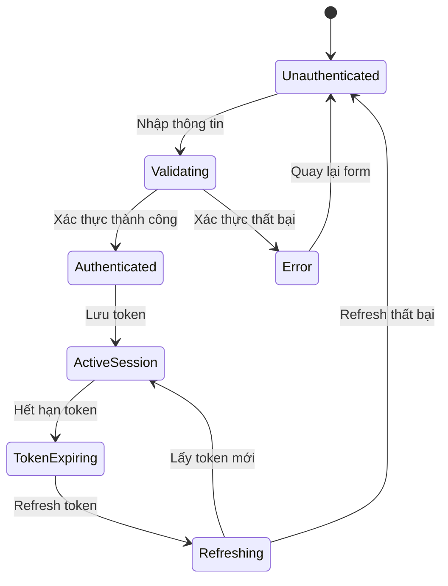
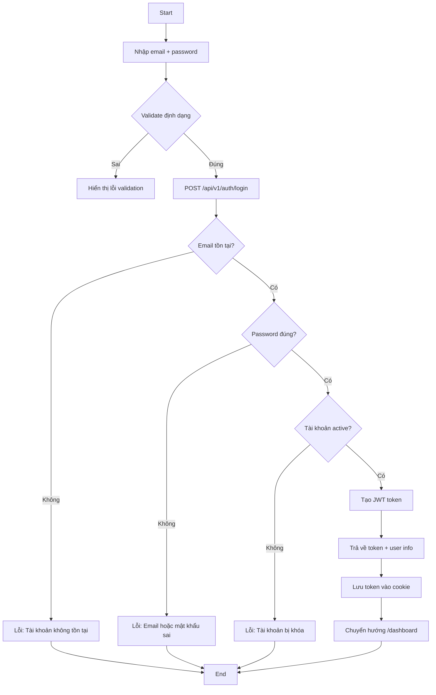
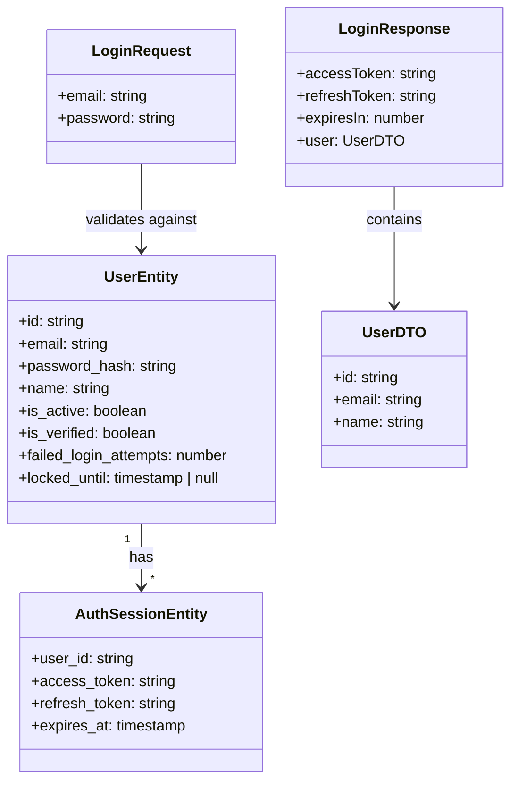

### TASK: Đăng nhập (Login)

### ENTIES: UserEntity, AuthSessionEntity

### EXECUTES: đăng nhập, xác thực, tạo session

------------------------------------------

### MÔ TẢ:
- Xác thực người dùng bằng email + mật khẩu
- Tạo session token (JWT) sau khi xác thực thành công
- Chuyển hướng đến trang dashboard sau khi đăng nhập
- Xử lý các trường hợp lỗi: sai mật khẩu, tài khoản không tồn tại, tài khoản bị khóa

------------------------------------------

### TÁC NHÂN (ACTORS):

- Actor chính: Người dùng (User)
- Actor phụ: Hệ thống xác thực (Auth System)

### DỮ LIỆU ĐẦU VÀO (INPUT):

| Tên trường | Kiểu dữ liệu | Bắt buộc | Ghi chú |
|---|---|---|---|
| email | string | Có | Định dạng email hợp lệ, tối đa 255 ký tự |
| password | string | Có | Tối thiểu 8 ký tự, tối đa 128 ký tự |

### QUY TRÌNH THỰC HIỆN (ACTIONS FLOW):

- Step 1: Người dùng nhập email và mật khẩu vào form đăng nhập
- Step 2: Frontend validate định dạng email và độ dài mật khẩu
- Step 3: Frontend gửi request POST /api/v1/auth/login
- Step 4: Backend xác thực email tồn tại trong database
- Step 5: Backend so sánh password đã hash với database
- Step 6: Backend kiểm tra trạng thái tài khoản (active/inactive)
- Step 7: Backend tạo JWT token và trả về response
- Step 8: Frontend lưu token vào cookie/localStorage
- Step 9: Frontend chuyển hướng đến /dashboard

### QUY TẮC NGHIỆP VỤ (BUSINESS LOGIC):

- Logic 1: Nếu email không tồn tại → trả về lỗi "Tài khoản không tồn tại"
- Logic 2: Nếu mật khẩu sai → trả về lỗi "Email hoặc mật khẩu không đúng"
- Logic 3: Nếu tài khoản bị khóa → trả về lỗi "Tài khoản đã bị khóa"
- Logic 4: Nếu vượt quá 5 lần đăng nhập sai trong 15 phút → tạm khóa tài khoản 30 phút
- Logic 5: JWT token có hiệu lực 24 giờ, refresh token có hiệu lực 7 ngày
- Logic 6: Không cho phép đăng nhập nếu email chưa được xác thực

### DỮ LIỆU ĐẦU RA (OUTPUT):

- Trạng thái: Thành công / Thất bại
- Dữ liệu trả về:
  - Success: { accessToken, refreshToken, expiresIn, user: { id, email, name } }
  - Failure: { message, code }

### BUSINESS ANALYSIS STANDARDS

1. Decision Table:

* Condition: Email tồn tại + Password đúng + Tài khoản active
- Case 1: Email không tồn tại → Lỗi "Tài khoản không tồn tại"
- Case 2: Email tồn tại + Password sai → Lỗi "Email hoặc mật khẩu không đúng"
- Case 3: Email tồn tại + Password đúng + Tài khoản bị khóa → Lỗi "Tài khoản đã bị khóa"
- Case 4: Email tồn tại + Password đúng + Tài khoản chưa xác thực → Lỗi "Vui lòng xác thực email"
- Case 5: Email tồn tại + Password đúng + Tài khoản active → Thành công, trả về token

---

2. Acceptance Criteria:

* [GIVEN] người dùng đã truy cập trang /login [WHEN] nhập email hợp lệ và mật khẩu đúng [THEN] hệ thống trả về JWT token và chuyển hướng đến /dashboard
* [GIVEN] người dùng đã truy cập trang /login [WHEN] nhập email không tồn tại [THEN] hệ thống hiển thị lỗi "Tài khoản không tồn tại"
* [GIVEN] người dùng đã truy cập trang /login [WHEN] nhập mật khẩu sai [THEN] hệ thống hiển thị lỗi "Email hoặc mật khẩu không đúng"
* [GIVEN] người dùng đã đăng nhập thành công [WHEN] truy cập trang /dashboard [THEN] hệ thống xác thực token và cho phép truy cập
* [GIVEN] người dùng đã bị khóa tài khoản [WHEN] cố gắng đăng nhập [THEN] hệ thống hiển thị lỗi "Tài khoản đã bị khóa"

---

3. Domain Model (Entity Mapping - Mô hình dữ liệu)

* UserEntity:
  - id: string (UUID)
  - email: string (unique, indexed)
  - password_hash: string
  - name: string
  - is_active: boolean
  - is_verified: boolean
  - failed_login_attempts: number
  - locked_until: timestamp | null
  - created_at: timestamp
  - updated_at: timestamp

* AuthSessionEntity:
  - user_id: string (FK → UserEntity.id)
  - access_token: string (hashed)
  - refresh_token: string (hashed)
  - expires_at: timestamp
  - created_at: timestamp

* Relationship: UserEntity (1) → AuthSessionEntity (*)

---

4. Test Case Specification:

* TC1: Đăng nhập thành công
  * Input: email="user@example.com", password="Pass123456"
  * Expected Output: { accessToken, refreshToken, user }
  * Edge Case: Token được lưu vào cookie httpOnly

* TC2: Đăng nhập với email không tồn tại
  * Input: email="notexist@example.com", password="Pass123456"
  * Expected Output: { message: "Tài khoản không tồn tại", code: "AUTH_001" }
  * Edge Case: Không tiết lộ thông tin tài khoản có tồn tại hay không

* TC3: Đăng nhập với mật khẩu sai
  * Input: email="user@example.com", password="WrongPass"
  * Expected Output: { message: "Email hoặc mật khẩu không đúng", code: "AUTH_002" }
  * Edge Case: Tăng số lần đăng nhập sai

* TC4: Đăng nhập khi tài khoản bị khóa
  * Input: email="locked@example.com", password="Pass123456"
  * Expected Output: { message: "Tài khoản đã bị khóa", code: "AUTH_003" }
  * Edge Case: Kiểm tra thời gian khóa hết hạn

* TC5: Đăng nhập khi vượt quá giới hạn đăng nhập sai
  * Input: 5 lần đăng nhập sai trong 15 phút
  * Expected Output: { message: "Tài khoản tạm khóa", code: "AUTH_004" }
  * Edge Case: Reset counter sau khi hết thời gian khóa

---

### UML & FLOW DIAGRAM

1. Sequence Diagram (Mermaid.js):

---

2. State Diagram (Mermaid.js):

---

3. Flowchart (Mermaid.js - graph TD):

---

4. Class Diagram (Mermaid.js):

---

### </> ÁNH XẠ KỸ THUẬT (TECHNICAL MAPPING):

#### Schemas:

1. shared/schemas/auth.schema.ts

* Giải quyết: Validate input đăng nhập (email format, password length)
* Validate: email regex, password min 8 chars, max 128 chars
* Dùng cho: Frontend validation + Backend validation

---

#### Types:

1. shared/types/auth.types.ts

* Định nghĩa: LoginRequest, LoginResponse, UserDTO, AuthSession
* Dùng cho: API contract, component props, composable return types

---

#### Utils:

1. shared/utils/auth.utils.ts

* Xử lý: Hash password (bcrypt), verify password, generate JWT
* Tái sử dụng: Dùng chung cho login và register

---

#### API:

1. server/api/v1/auth/login.post.ts

* Xử lý: Xác thực user, tạo JWT, trả về token
* Input: { email, password }
* Output: { accessToken, refreshToken, user }

---

#### Components:

1. app/components/kits/KitInput.vue

* Vai trò: UI input component (email/password)
* Dùng cho: Form đăng nhập

2. app/components/kits/KitButton.vue

* Vai trò: UI button component
* Dùng cho: Nút submit đăng nhập

3. app/components/forms/FormKit.vue

* Vai trò: Wrapper form với validation
* Dùng cho: Bao form đăng nhập

4. app/components/popups/PopAlert.vue

* Vai trò: Hiển thị thông báo lỗi/thành công
* Dùng cho: Hiển thị lỗi đăng nhập

---

#### Composables:

1. app/composables/useAuth.ts

* Xử lý: Login, logout, check auth status
* State: user, isAuthenticated, token
* API call: POST /api/v1/auth/login

2. app/composables/useFormValidation.ts

* Xử lý: Validate form fields
* State: errors, isValid
* Dùng cho: Form validation

---

#### Pages:

1. app/pages/login.vue

* Route: /login
* Chức năng: Form đăng nhập, xử lý submit, chuyển hướng

---

#### Middleware:

1. app/middleware/auth.ts

* Mục đích: Kiểm tra token hợp lệ trước khi truy cập protected routes
* Áp dụng: /dashboard, /profile, /settings