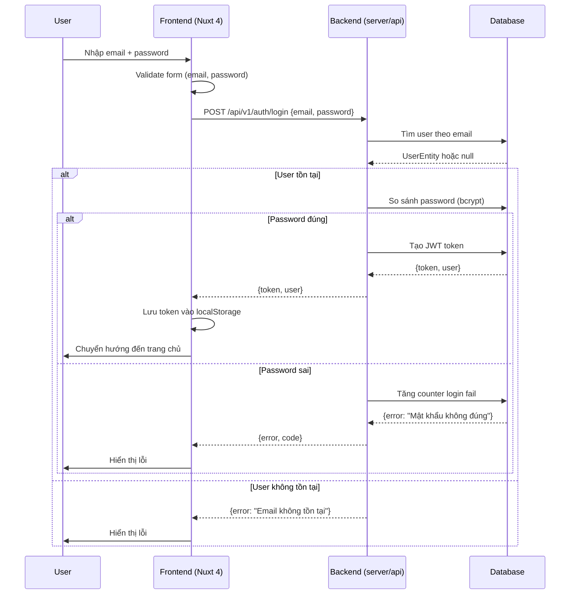
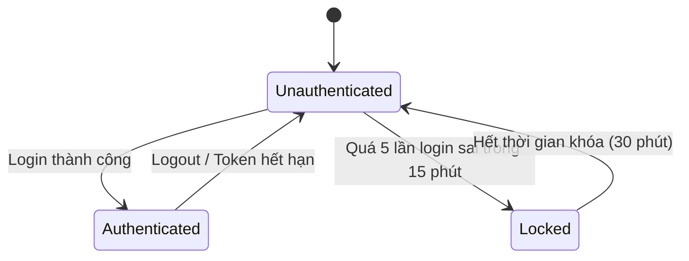

### TASK: Đăng nhập (Login)

### ENTIES: UserEntity, AuthTokenEntity

### EXECUTES: Xác thực, Tạo token, Lưu session

------------------------------------------

### MÔ TẢ:
- Xác thực người dùng dựa trên email và mật khẩu
- Tạo JWT token khi xác thực thành công
- Lưu token vào localStorage để duy trì phiên đăng nhập
- Chuyển hướng đến trang chủ sau khi đăng nhập thành công

------------------------------------------

### TÁC NHÂN (ACTORS):

- Actor chính: Người dùng (User)
- Actor phụ: Hệ thống xác thực (Auth System)

### DỮ LIỆU ĐẦU VÀO (INPUT):

| Tên trường | Kiểu dữ liệu | Bắt buộc | Ghi chú |
|---|---|---|---|
| email | string | Có | Định dạng email hợp lệ |
| password | string | Có | Mật khẩu người dùng nhập |

### QUY TRÌNH THỰC HIỆN (ACTIONS FLOW):

- Step 1: Người dùng nhập email và mật khẩu vào form đăng nhập
- Step 2: Người dùng nhấn nút "Đăng nhập"
- Step 3: Hệ thống validate dữ liệu đầu vào (email hợp lệ, mật khẩu không rỗng)
- Step 4: Gửi request POST /api/v1/auth/login lên backend
- Step 5: Backend xác thực email và mật khẩu với database
- Step 6: Nếu thành công → trả về JWT token
- Step 7: Frontend lưu token vào localStorage
- Step 8: Chuyển hướng đến trang chủ (hoặc trang trước đó)

### QUY TẮC NGHIỆP VỤ (BUSINESS LOGIC):

- Logic 1: Nếu email không tồn tại trong hệ thống → báo lỗi "Email không tồn tại"
- Logic 2: Nếu mật khẩu sai → báo lỗi "Mật khẩu không đúng"
- Logic 3: Nếu tài khoản bị khóa → báo lỗi "Tài khoản đã bị khóa"
- Logic 4: Nếu xác thực thành công → tạo JWT token với thời hạn 24h
- Logic 5: Nếu quá 5 lần đăng nhập sai trong 15 phút → tạm khóa tài khoản 30 phút

### DỮ LIỆU ĐẦU RA (OUTPUT):

- Trạng thái: Thành công / Thất bại
- Dữ liệu trả về:
  - Thành công: `{ token: string, user: UserEntity }`
  - Thất bại: `{ error: string, code: string }`

### BUSINESS ANALYSIS STANDARDS

1. Decision Table:

* Condition: Email tồn tại + Mật khẩu đúng
- Case 1: Email tồn tại + Mật khẩu đúng → Thành công, trả về token
- Case 2: Email tồn tại + Mật khẩu sai → Lỗi "Mật khẩu không đúng"
- Case 3: Email không tồn tại → Lỗi "Email không tồn tại"
- Case 4: Tài khoản bị khóa → Lỗi "Tài khoản đã bị khóa"
- Case 5: Quá 5 lần đăng nhập sai trong 15 phút → Lỗi "Quá nhiều lần thử, vui lòng thử lại sau 30 phút"

---

2. Acceptance Criteria:

* [GIVEN] người dùng đã truy cập trang đăng nhập [WHEN] người dùng nhập đúng email và mật khẩu [THEN] hệ thống trả về token và chuyển hướng đến trang chủ
* [GIVEN] người dùng đã truy cập trang đăng nhập [WHEN] người dùng nhập sai mật khẩu [THEN] hệ thống báo lỗi "Mật khẩu không đúng"
* [GIVEN] người dùng đã truy cập trang đăng nhập [WHEN] người dùng nhập email không tồn tại [THEN] hệ thống báo lỗi "Email không tồn tại"
* [GIVEN] người dùng đã đăng nhập sai 5 lần trong 15 phút [WHEN] người dùng thử đăng nhập lại [THEN] hệ thống báo lỗi "Quá nhiều lần thử, vui lòng thử lại sau 30 phút"

---

3. Domain Model (Entity Mapping - Mô hình dữ liệu)

* UserEntity:
  - id: string
  - email: string
  - password: string (hashed)
  - name: string
  - role: string
  - is_active: boolean
  - created_at: Date
  
* AuthTokenEntity:
  - token: string (JWT)
  - user_id: string (FK → UserEntity.id)
  - expires_at: Date
  - created_at: Date

- Relationship: UserEntity → AuthTokenEntity (1:N)

---

4. Test Case Specification:

* TC1: Đăng nhập thành công
  * Input: { email: "user@example.com", password: "password123" }
  * Expected Output: { token: "jwt_token", user: { id, email, name, role } }
  * Edge Case: Token hết hạn → tự động logout

* TC2: Đăng nhập sai mật khẩu
  * Input: { email: "user@example.com", password: "wrong_password" }
  * Expected Output: { error: "Mật khẩu không đúng", code: "INVALID_CREDENTIALS" }
  * Edge Case: Không có tài khoản → { error: "Email không tồn tại", code: "EMAIL_NOT_FOUND" }

* TC3: Quá nhiều lần đăng nhập sai
  * Input: { email: "user@example.com", password: "wrong_password" } (lần thứ 6)
  * Expected Output: { error: "Quá nhiều lần thử, vui lòng thử lại sau 30 phút", code: "ACCOUNT_LOCKED" }
  * Edge Case: Sau 30 phút → reset counter

---

### UML & FLOW DIAGRAM

1. Sequence Diagram (Mermaid.js):



---

2. State Diagram (Mermaid.js):



---

3. Flowchart (Mermaid.js - graph TD):

```mermaid
graph TD
    A[Người dùng nhập email + password] --> B{Validate form}
    B -->|Sai| C[Báo lỗi validation]
    B -->|Đúng| D[Gửi request POST /api/v1/auth/login]
    D --> E{Backend xác thực}
    E -->|Email không tồn tại| F[Báo lỗi "Email không tồn tại"]
    E -->|Password sai| G[Báo lỗi "Mật khẩu không đúng"]
    E -->|Quá 5 lần sai trong 15 phút| H[Báo lỗi "Tài khoản bị khóa tạm thời"]
    E -->|Thành công| I[Tạo JWT token]
    I --> J[Lưu token vào localStorage]
    J --> K[Chuyển hướng đến trang chủ]
```

---

4. Class Diagram (Mermaid.js):

```mermaid
classDiagram
    class UserEntity {
        +id: string
        +email: string
        +password: string
        +name: string
        +role: string
        +is_active: boolean
        +created_at: Date
    }

    class AuthTokenEntity {
        +token: string
        +user_id: string
        +expires_at: Date
        +created_at: Date
    }

    class LoginRequest {
        +email: string
        +password: string
    }

    class LoginResponse {
        +token: string
        +user: UserEntity
    }

    class LoginError {
        +error: string
        +code: string
    }

    UserEntity --> AuthTokenEntity : 1:N
    LoginRequest --> UserEntity : validates against
    LoginResponse --> UserEntity : contains
```

---

### </> ÁNH XẠ KỸ THUẬT (TECHNICAL MAPPING):

#### Schemas:

1. shared/types/auth.schema.ts

* Giải quyết: Validate dữ liệu đăng nhập (email, password)
* Validate: email format, password length >= 8
* Dùng cho: Form validation + API request validation

---

#### Types:

1. shared/types/auth.ts

* Định nghĩa: LoginRequest, LoginResponse, UserEntity, AuthTokenEntity
* Dùng cho: TypeScript typing cho frontend và backend

---

#### Utils:

1. shared/utils/auth.ts

* Xử lý: Tạo JWT token, verify token, hash password (bcrypt)
* Tái sử dụng: Cả frontend và backend

---

#### API:

1. server/api/v1/auth/login.post.ts

* Xử lý: Xác thực đăng nhập, tạo JWT token
* Input: { email: string, password: string }
* Output: { token: string, user: UserEntity } hoặc { error: string, code: string }

---

#### Components:

1. app/components/kits/KitInput.vue

* Vai trò: UI input component (email, password)
* Dùng cho: Form đăng nhập

2. app/components/kits/KitButton.vue

* Vai trò: UI button component
* Dùng cho: Nút "Đăng nhập"

3. app/components/forms/FormKit.vue

* Vai trò: Form wrapper
* Dùng cho: Bao form đăng nhập

4. app/components/business/LoginForm.vue

* Vai trò: Business UI form đăng nhập
* Xử lý: Bind data, handle submit, show error/success

---

#### Composables:

1. app/composables/useAuth.ts

* Xử lý: Quản lý authentication state, login/logout
* State: isAuthenticated, user, token
* API call: useFetch('/api/v1/auth/login')

---

#### Pages:

1. app/pages/auth/login.vue

* Route: /auth/login
* Chức năng: Hiển thị form đăng nhập, xử lý submit

---

#### Middleware:

1. app/middleware/auth.ts

* Mục đích: Kiểm tra token hợp lệ trên các route được bảo vệ
* Áp dụng: Tất cả route trừ /auth/login, /auth/register, /auth/forgot-password