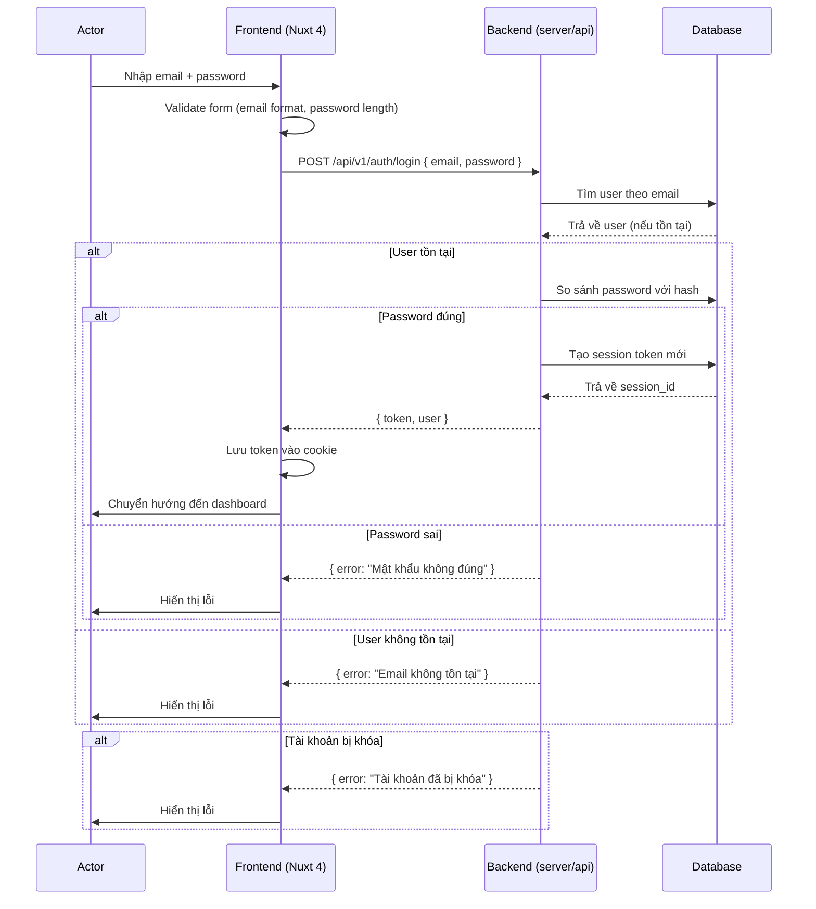
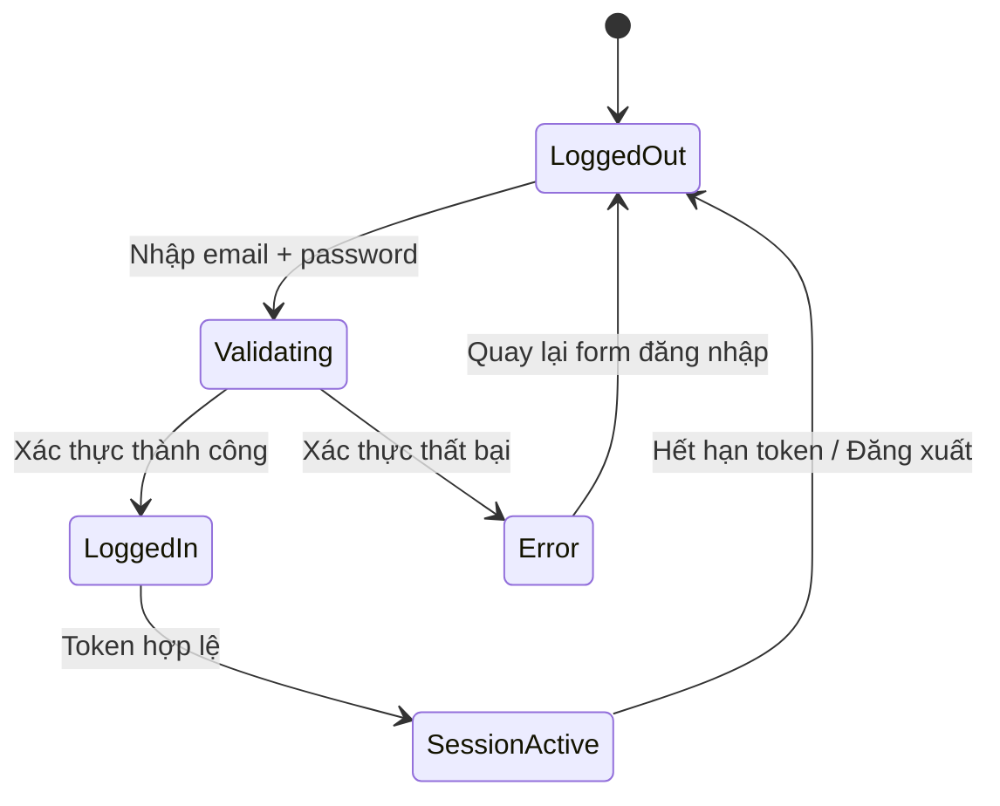
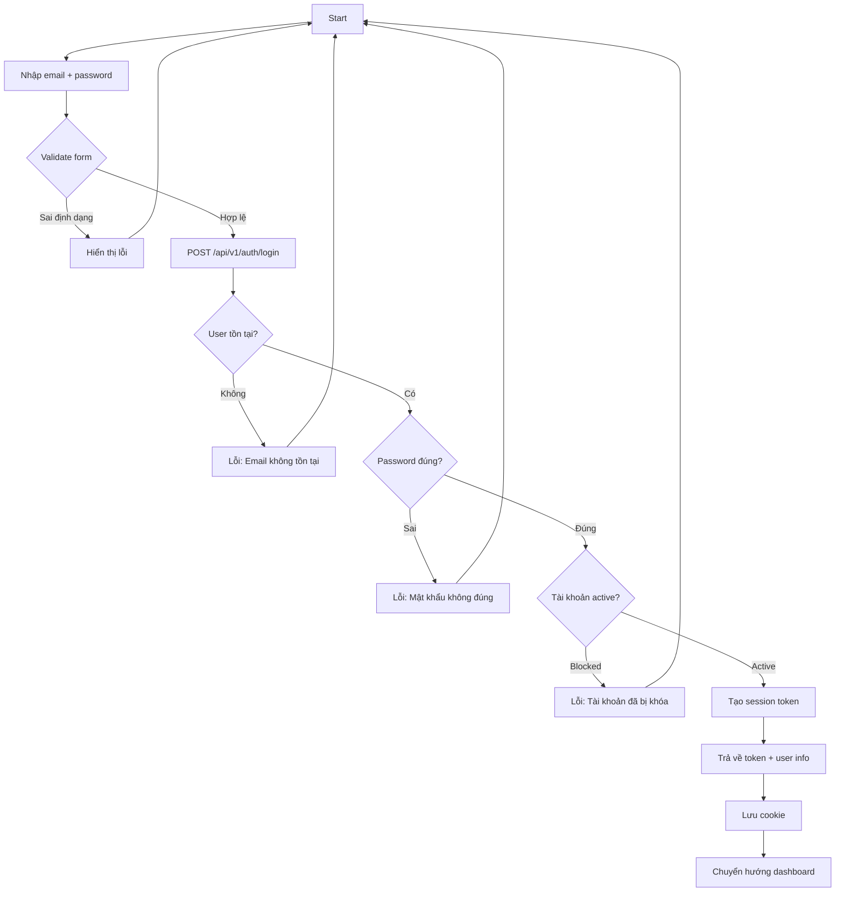
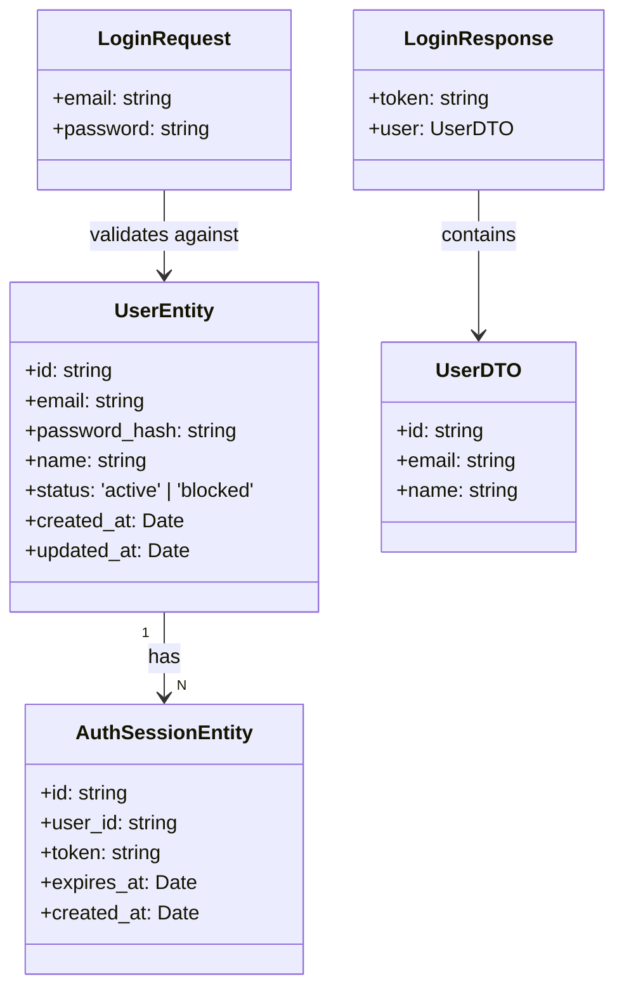

### TASK: Đăng nhập (Login)

### ENTIES: UserEntity, AuthSessionEntity

### EXECUTES: đăng nhập, xác thực token, đăng xuất

------------------------------------------

### MÔ TẢ: 
- Xác thực người dùng bằng email và mật khẩu
- Tạo session token khi đăng nhập thành công
- Lưu thông tin session vào cookie/localStorage
- Kiểm tra trạng thái tài khoản (active/blocked) trước khi cho phép đăng nhập

------------------------------------------

### TÁC NHÂN (ACTORS):

- Actor chính: Người dùng (Customer)
- Actor phụ: Hệ thống xác thực (Auth System)

### DỮ LIỆU ĐẦU VÀO (INPUT):

- email | string | Bắt buộc | Định dạng email hợp lệ
- password | string | Bắt buộc | Độ dài tối thiểu 8 ký tự

### QUY TRÌNH THỰC HIỆN (ACTIONS FLOW):

- Step 1: Người dùng nhập email và mật khẩu
- Step 2: Frontend validate form (Kiểm tra định dạng email, độ dài mật khẩu)
- Step 3: Gửi request POST /api/v1/auth/login
- Step 4: Backend tìm user theo email
- Step 5: Backend so sánh password với hash đã lưu
- Step 6: Nếu đúng → tạo session token → trả về response
- Step 7: Frontend lưu token vào cookie/localStorage
- Step 8: Chuyển hướng đến trang dashboard

### QUY TẮC NGHIỆP VỤ (BUSINESS LOGIC):

- Logic 1: Nếu email không tồn tại → trả về lỗi "Email không tồn tại"
- Logic 2: Nếu password sai → trả về lỗi "Mật khẩu không đúng"
- Logic 3: Nếu tài khoản bị khóa (status = blocked) → trả về lỗi "Tài khoản đã bị khóa"
- Logic 4: Nếu email không đúng định dạng → trả về lỗi "Email không hợp lệ"
- Logic 5: Nếu mật khẩu ngắn hơn 8 ký tự → trả về lỗi "Mật khẩu phải có ít nhất 8 ký tự"
- Logic 6: Sau 5 lần đăng nhập sai liên tiếp → khóa tài khoản tạm thời 30 phút

### DỮ LIỆU ĐẦU RA (OUTPUT):

- Trạng thái: Thành công / Thất bại
- Dữ liệu trả về: { token, user: { id, email, name } }
- Cookie: auth_token (httpOnly, secure)

### BUSINESS ANALYSIS STANDARDS

1. Decision Table:

* Condition: Email tồn tại + Password đúng + Tài khoản active
- Case 1: Thành công → trả về token + chuyển hướng dashboard
- Case 2: Email không tồn tại → lỗi "Email không tồn tại"
- Case 3: Password sai → lỗi "Mật khẩu không đúng"
- Case 4: Tài khoản bị khóa → lỗi "Tài khoản đã bị khóa"
- Case 5: Email sai định dạng → lỗi "Email không hợp lệ"
- Case 6: Mật khẩu < 8 ký tự → lỗi "Mật khẩu phải có ít nhất 8 ký tự"

---

2. Acceptance Criteria:

* [GIVEN] người dùng đã nhập email và mật khẩu hợp lệ [WHEN] nhấn nút đăng nhập [THEN] hệ thống trả về token và chuyển hướng đến dashboard
* [GIVEN] người dùng nhập email sai định dạng [WHEN] nhấn nút đăng nhập [THEN] hiển thị lỗi "Email không hợp lệ"
* [GIVEN] người dùng nhập password sai [WHEN] nhấn nút đăng nhập [THEN] hiển thị lỗi "Mật khẩu không đúng"
* [GIVEN] tài khoản đã bị khóa [WHEN] thực hiện đăng nhập [THEN] hiển thị lỗi "Tài khoản đã bị khóa"

---

3. Domain Model (Entity Mapping - Mô hình dữ liệu)

* UserEntity:
  - id: string (UUID)
  - email: string (unique)
  - password_hash: string
  - name: string
  - status: enum('active', 'blocked')
  - created_at: datetime
  - updated_at: datetime

* AuthSessionEntity:
  - id: string (UUID)
  - user_id: string (FK → UserEntity.id)
  - token: string (unique)
  - expires_at: datetime
  - created_at: datetime

* Relationship: UserEntity → AuthSessionEntity (1:N)

---

4. Test Case Specification:

* TC1: Đăng nhập thành công
  * Input: email = "user@example.com", password = "password123"
  * Expected Output: { token: "abc...", user: { id, email, name } }
  * Edge Case: Session đã tồn tại → tạo session mới

* TC2: Đăng nhập với email không tồn tại
  * Input: email = "notexist@example.com", password = "password123"
  * Expected Output: { error: "Email không tồn tại" }
  * Edge Case: Không tiết lộ thông tin user đã tồn tại hay chưa

* TC3: Đăng nhập với password sai
  * Input: email = "user@example.com", password = "wrongpass"
  * Expected Output: { error: "Mật khẩu không đúng" }
  * Edge Case: Không tiết lộ password sai hay email sai

---

### UML & FLOW DIAGRAM

1. Sequence Diagram (Mermaid.js):

---

2. State Diagram (Mermaid.js):

---

3. Flowchart (Mermaid.js - graph TD):

---

4. Class Diagram (Mermaid.js):

---

### </> ÁNH XẠ KỸ THUẬT (TECHNICAL MAPPING):

#### Schemas:

1. shared/schemas/auth.schema.ts

* Giải quyết: Validate input đăng nhập (email format, password length)
* Validate: Joi/Zod schema cho email và password
* Dùng cho: Frontend form validation + Backend API validation

---

#### Types:

1. shared/types/auth.types.ts

* Định nghĩa: LoginRequest, LoginResponse, UserDTO, AuthSession
* Dùng cho: API contract + Component props + Composable return types

---

#### Utils:

1. shared/utils/auth.utils.ts

* Xử lý: Hash password (bcrypt), verify password, generate token
* Tái sử dụng: Backend API + Frontend (nếu cần)

---

#### API:

1. server/api/v1/auth/login.post.ts

* Xử lý: Xác thực đăng nhập, tạo session token
* Input: { email, password }
* Output: { token, user: { id, email, name } }

2. server/api/v1/auth/logout.post.ts

* Xử lý: Hủy session hiện tại
* Input: token (từ cookie)
* Output: { success: true }

---

#### Components:

1. app/components/kits/KitInput.vue

* Vai trò: UI thuần - Input field với validation
* Dùng cho: Form đăng nhập (email, password)

2. app/components/kits/KitButton.vue

* Vai trò: UI thuần - Button với loading state
* Dùng cho: Nút đăng nhập

3. app/components/forms/FormKit.vue

* Vai trò: Wrapper form với validation
* Dùng cho: Bao quanh FormGrid, FormHeader, FormFooter

4. app/components/forms/FormGrid.vue

* Vai trò: Grid layout cho các input fields
* Dùng cho: Sắp xếp email + password trong form đăng nhập

5. app/components/forms/FormHeader.vue

* Vai trò: Tiêu đề form
* Dùng cho: Hiển thị "Đăng nhập"

6. app/components/forms/FormFooter.vue

* Vai trò: Footer form với nút submit
* Dùng cho: Nút đăng nhập + link quên mật khẩu

7. app/components/popups/PopAlert.vue

* Vai trò: Popup thông báo lỗi
* Dùng cho: Hiển thị lỗi đăng nhập (sai email, sai password)

---

#### Composables:

1. app/composables/useAuth.ts

* Xử lý: Quản lý trạng thái đăng nhập, gọi API login/logout
* State: isLoggedIn, user, token
* API call: POST /api/v1/auth/login, POST /api/v1/auth/logout

2. app/composables/useForm.ts

* Xử lý: Quản lý form validation, submit state
* State: isValid, isSubmitting, errors
* API call: Không (chỉ xử lý client-side)

---

#### Pages:

1. app/pages/login.vue

* Route: /login
* Chức năng: Form đăng nhập + xử lý redirect khi đã đăng nhập

---

#### Middleware:

1. app/middleware/auth.ts

* Mục đích: Kiểm tra token hợp lệ, bảo vệ routes cần auth
* Áp dụng: /dashboard, /profile, /orders (các route cần xác thực)