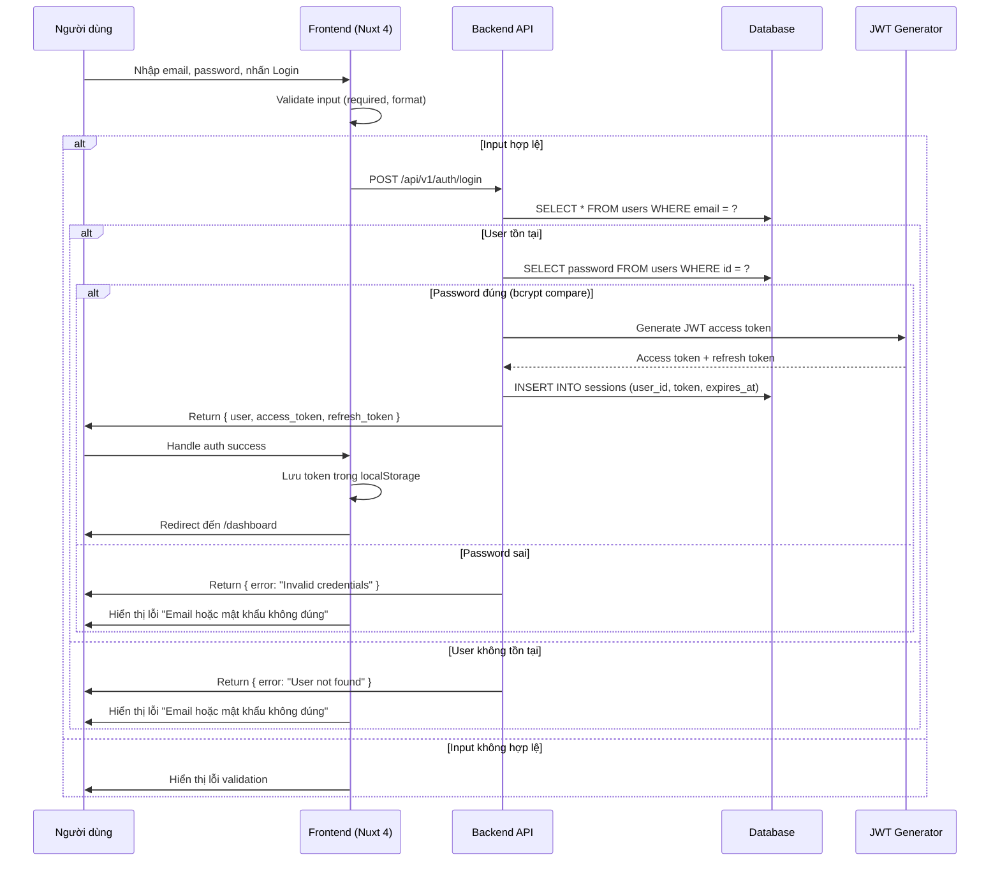
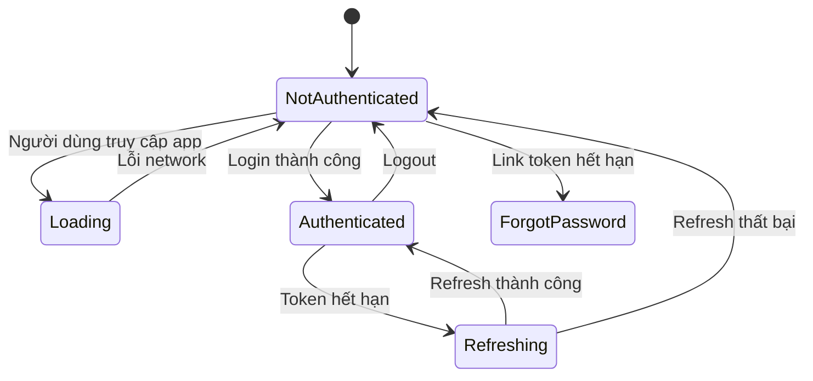
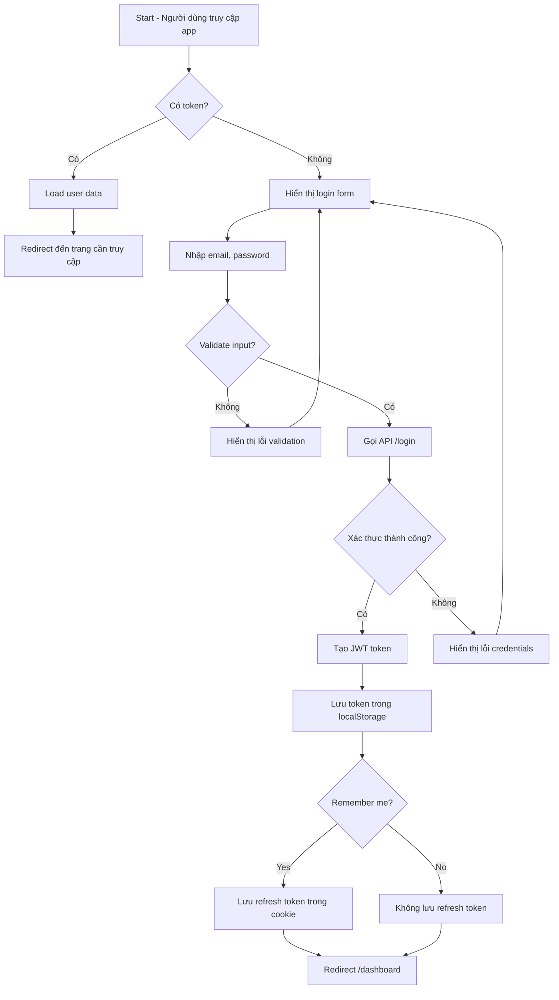
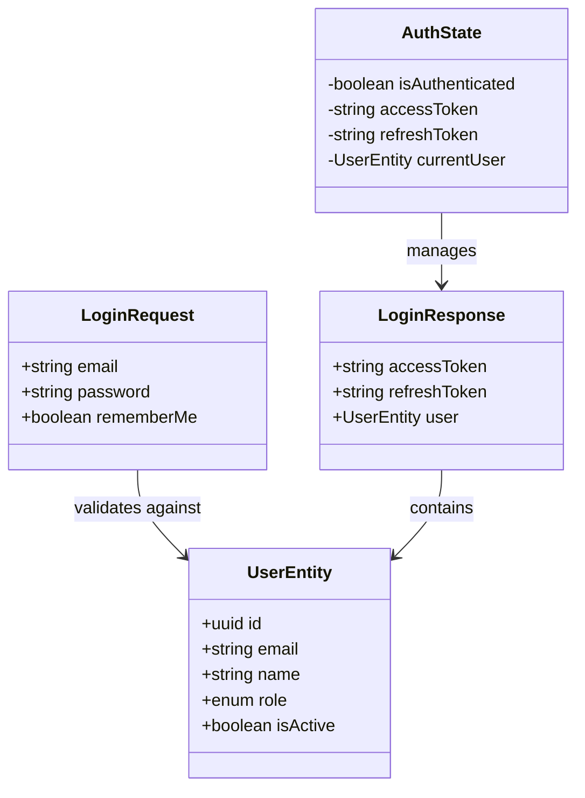

The user wants me to analyze the login feature and create a plan for implementing it following the strict business analysis standards I've been given. Let me design a comprehensive plan for a login feature in a Nuxt 4 application.

Let me think about what a login feature entails:

1. **Entities involved:**
   - UserEntity (the authenticated user)
   - SessionEntity (optional, if we have sessions)
   - AuthTokenEntity (if we have tokens stored)

2. **Actions:**
   - Login
   - Logout
   - Refresh token

3. **Business Logic:**
   - Validate credentials
   - Generate JWT token
   - Set authentication state
   - Redirect based on auth status

4. **Security considerations:**
   - Password hashing (using a library like bcrypt)
   - JWT configuration
   - Rate limiting (optional)
   - Remember me functionality (optional)

Let me create a comprehensive plan following all the required formats.
## TASK: Đăng Nhập (Login)

### ENTITIES:
- UserEntity
- SessionEntity

### EXECUTES:
- Login
- Logout

------------------------------------------

### MÔ TẢ: 
- Xác thực người dùng với email và mật khẩu
- Tạo JWT token cho phiên đăng nhập
- Quản lý trạng thái xác thực toàn ứng dụng

------------------------------------------

### TÁC NHÂN (ACTORS):
- Actor chính: Người dùng (User)
- Actor phụ: Hệ thống (System)

### DỮ LIỆU ĐẦU VÀO (INPUT):

| Tên trường | Kiểu dữ liệu | Bắt buộc | Ghi chú |
|------------|--------------|----------|---------|
| email | string | Có | Email hợp lệ, tối đa 255 ký tự |
| password | string | Có | Mật khẩu đã mã hóa, tối thiểu 8 ký tự |
| rememberMe | boolean | Không | Mặc định false |

### QUY TRÌNH THỰC HIỆN (ACTIONS FLOW):

- **Step 1:** Người dùng nhập email và mật khẩu vào form đăng nhập
- **Step 2:** Frontend gọi API `/api/v1/auth/login` với POST
- **Step 3:** Backend xác thực credentials trong database
- **Step 4:** Nếu thành công, tạo JWT token và trả về
- **Step 5:** Frontend lưu token, cập nhật state auth, redirect

### QUY TẮC NGHIỆP VỤ (BUSINESS LOGIC):

1. Nếu email tồn tại và mật khẩu đúng → Login thành công
2. Nếu email không tồn tại hoặc mật khẩu sai → Login thất bại
3. Nếu rememberMe = true → Lưu refresh token trong cookie
4. Nếu token hết hạn → Redirect đến trang quên mật khẩu

### DỮ LIỆU ĐẦU RA (OUTPUT):

- **Thành công:** JWT access token, refresh token, user info
- **Thất bại:** Error message, không có token

### BUSINESS ANALYSIS STANDARDS

#### 1. Decision Table:

| Condition | Case 1 (Success) | Case 2 (Failure) |
|-----------|------------------|------------------|
| Email tồn tại trong DB | Tạo token, redirect /dashboard | - |
| Mật khẩu đúng (hash match) | Trả về user data + tokens | - |
| Mật khẩu sai hoặc email không tồn tại | - | Trả về error message |
| Remember me = true | Lưu refresh token trong cookie HttpOnly | - |
| Remember me = false | Không lưu refresh token | - |

---

#### 2. Acceptance Criteria:

- [GIVEN] Người dùng nhập email và mật khẩu đúng [WHEN] nhấn Login [THEN] được redirect đến /dashboard với trạng thái authenticated
- [GIVEN] Người dùng nhập email hoặc mật khẩu sai [WHEN] nhấn Login [THEN] nhận được thông báo lỗi rõ ràng
- [GIVEN] Token hết hạn [WHEN] người dùng truy cập yêu cầu cần auth [THEN] tự động refresh token hoặc redirect đến login

---

#### 3. Domain Model (Entity Mapping):

**UserEntity:**
- `id`: UUID | unique | Primary key
- `email`: string(255) | unique | FK → none | Email của người dùng, phải hợp lệ
- `password`: string(255) | NULL | FK → none | Hash bcrypt của mật khẩu
- `name`: string(100) | NULL | FK → none | Tên hiển thị
- `role`: enum('user','admin') | 'user' | FK → none | Vai trò người dùng
- `is_active`: boolean | true | FK → none | Trạng thái tài khoản

**SessionEntity:**
- `id`: UUID | unique | Primary key
- `user_id`: UUID | FK → UserEntity.id | FK → UserEntity.id | ID người dùng sở hữu session
- `token`: string(255) | unique | FK → none | JWT access token
- `expires_at`: datetime | NULL | FK → none | Thời gian hết hạn
- `refresh_token`: string(255) | NULL | FK → none | Refresh token (nếu có)

---

#### 4. Test Case Specification:

**TC1 - Login thành công:**
- Input: email="test@example.com", password="correct_password"
- Expected Output: Redirect đến /dashboard, localStorage có access_token
- Edge Case: Token được tạo với expiry 24h

**TC2 - Login thất bại:**
- Input: email="invalid@example.com", password="wrong"
- Expected Output: Hiển thị thông báo lỗi "Email hoặc mật khẩu không đúng"
- Edge Case: Không tạo token nào

**TC3 - Remember me:**
- Input: email="test@example.com", password="correct_password", rememberMe=true
- Expected Output: Cookie HttpOnly chứa refresh_token được tạo
- Edge Case: Cookie chỉ được thiết lập khi rememberMe=true

---

### UML & FLOW DIAGRAM

#### 1. Sequence Diagram (Mermaid.js):



---

#### 2. State Diagram (Mermaid.js):



---

#### 3. Flowchart (Mermaid.js - graph TD):



---

#### 4. Class Diagram (Mermaid.js):



---

### </> ÁNH XẠ KỸ THUẬT (TECHNICAL MAPPING):

#### Schemas:

1. **shared/types/auth.schema.ts**
- Giải quyết: Validation rules cho login request
- Validate: Email format, password strength requirements
- Dùng cho: Zod validation trong API endpoints

```typescript
// shared/types/auth.schema.ts
import { z } from 'zod';

export const loginRequestSchema = z.object({
  email: z.string().email('Email không hợp lệ'),
  password: z.string().min(8, 'Mật khẩu tối thiểu 8 ký tự'),
  rememberMe: z.boolean().default(false)
});

export type LoginRequest = z.infer<typeof loginRequestSchema>;
```

---

#### Types:

1. **shared/types/auth.ts**
- Định nghĩa: Auth context, user types, response types
- Dùng cho: API responses, frontend auth state

```typescript
// shared/types/auth.ts
import { UserEntity } from './user';

export interface AuthResponse {
  accessToken: string;
  refreshToken: string;
  user: UserEntity;
}

export interface AuthContext {
  isAuthenticated: boolean;
  accessToken: string | null;
  refreshToken: string | null;
  user: UserEntity | null;
}
```

---

#### Utils:

1. **shared/utils/auth.ts**
- Xử lý: JWT token generation, validation, refresh logic
- Tái sử dụng: Composables và API handlers

```typescript
// shared/utils/auth.ts
import { jwtVerify, jwtSign } from 'jsonwebtoken';

export const generateAccessToken = (userId: string): string => {
  return jwtSign({ userId, type: 'access' }, process.env.JWT_SECRET!, {
    expiresIn: '24h'
  });
};

export const verifyToken = (token: string): { valid: boolean; payload?: any } => {
  try {
    const { payload } = jwtVerify(token, process.env.JWT_SECRET!);
    return { valid: true, payload };
  } catch {
    return { valid: false };
  }
};
```

---

#### API:

1. **server/api/v1/auth/login.post.ts**
- Xử lý: Login logic, token generation, session creation
- Input: LoginRequest (email, password, rememberMe)
- Output: AuthResponse hoặc error

```typescript
// server/api/v1/auth/login.post.ts
import { verifyToken } from '../../../utils/auth';

export default defineEventHandler(async (event) => {
  const body = await readBody(event);
  const { email, password } = parse(body);
  
  // Find user, verify password, generate tokens...
});
```

2. **server/api/v1/auth/logout.post.ts**
- Xử lý: Invalidate session, clear tokens
- Input: Authorization header (Bearer token)
- Output: Success message

---

#### Components:

1. **app/components/forms/LoginForm.vue**
- Vai trò: UI form đăng nhập thuần
- Dùng cho: Email, password input, remember me checkbox, submit button

2. **app/components/business/AuthLayout.vue**
- Vai trò: Layout wrapper với auth protection
- Xử lý: Check auth state, redirect logic

---

#### Composables:

1. **app/composables/useAuth.ts**
- Xử lý: Auth state management, token refresh
- State: isAuthenticated, user, accessToken, refreshToken
- API call: login(), logout(), refreshAccessToken()

```typescript
// app/composables/useAuth.ts
import { ref, computed } from 'vue';

export const useAuth = () => {
  const accessToken = ref<string | null>(null);
  const refreshToken = ref<string | null>(null);
  const user = ref<UserEntity | null>(null);
  
  // Methods: login, logout, refresh, getCurrentUser...
};
```

2. **app/composables/useTokenRefresh.ts**
- Xử lý: Auto-refresh token khi gần hết hạn
- State: tokenExpiryTime, isRefreshing

---

#### Pages:

1. **app/pages/login.vue**
- Route: `/login`
- Chức năng: Trang đăng nhập chính

2. **app/pages/dashboard.vue**
- Route: `/dashboard`
- Chức năng: Protected route, yêu cầu auth

---

#### Middleware:

1. **app/middleware/auth.ts**
- Mục đích: Protect routes requiring authentication
- Áp dụng: All routes except public paths (/login, /register, /forgot-password)

```typescript
// app/middleware/auth.ts
export default defineNuxtRouteMiddleware(async () => {
  const { isAuthenticated } = useAuth();
  
  if (!isAuthenticated.value) {
    return navigateTo('/login');
  }
});
```

---

### ĐỐI TƯỢNG SỬ DỤNG:

- **Frontend Dev**: useForm, useAuth composable, LoginForm component
- **Backend Dev**: login endpoint, JWT configuration, session management
- **QA/Test**: Test cases cho success/failure scenarios, edge cases