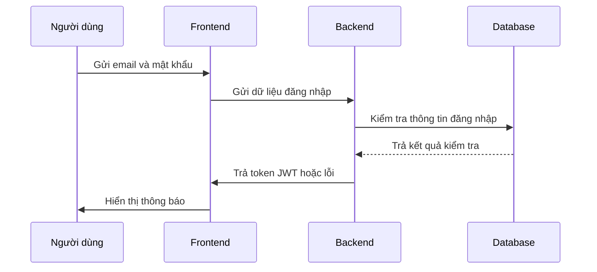
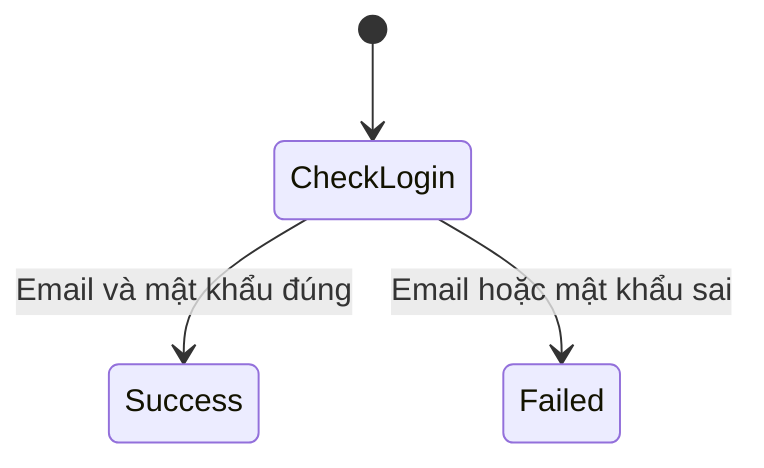
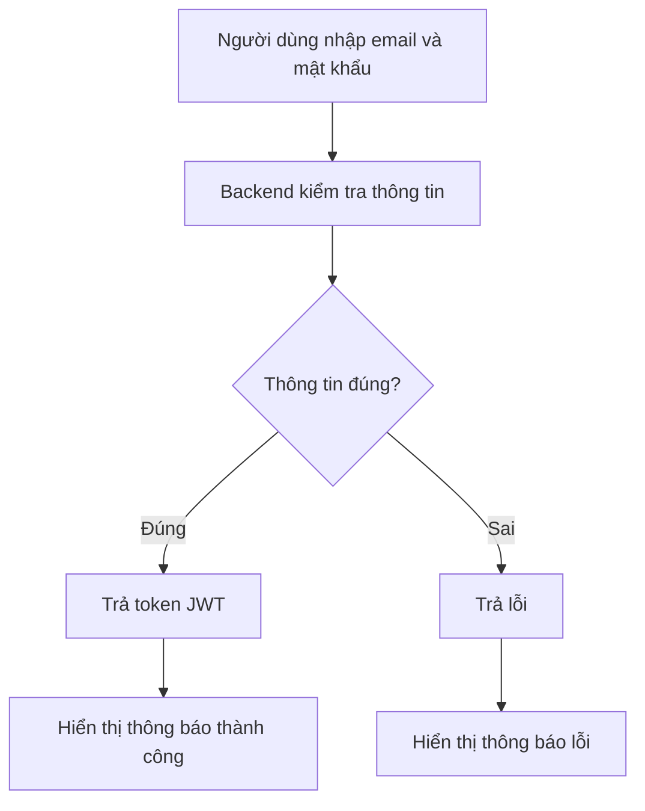
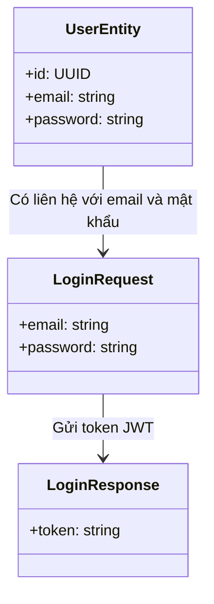

### TASK: Đăng nhập

### ENTITIES:
- UserEntity

### EXECUTES:
- Đăng nhập
- Xác thực

------------------------------------------  

### MÔ TẢ:  
Giải quyết vấn đề người dùng cần đăng nhập vào hệ thống để truy cập các chức năng.  
Giải quyết vấn đề người dùng cần xác thực thông tin đăng nhập để được quyền truy cập vào tài khoản.

------------------------------------------  

### TÁC NHÂN (ACTORS):  
- Actor chính: Người dùng (User)  
- Actor phụ: Hệ thống (Backend)

### DỮ LIỆU ĐẦU VÀO (INPUT):  
- email: string | required | Ghi chú: Email đăng nhập  
- password: string | required | Ghi chú: Mật khẩu  

### QUY TRÌNH THỰC HIỆN (ACTIONS FLOW):  
- Step 1: Người dùng nhập email và mật khẩu vào form đăng nhập.  
- Step 2: Gọi API đăng nhập với dữ liệu đầu vào.  
- Step 3: Backend kiểm tra thông tin đăng nhập.  
- Step 4: Nếu thông tin đúng, trả về token JWT. Nếu sai, trả về lỗi.

### QUY TẮC NGHIỆP VỤ (BUSINESS LOGIC):  
- Nếu email và mật khẩu đúng, thì xác thực thành công.  
- Nếu email hoặc mật khẩu sai, thì xác thực thất bại.

### DỮ LIỆU ĐẦU RA (OUTPUT):  
- Trạng thái: Thành công / Thất bại  
- Dữ liệu trả về: Token JWT (nếu thành công), hoặc lỗi (nếu thất bại)

### BUSINESS ANALYSIS STANDARDS  

1. Decision Table:  
* Condition: Email và mật khẩu đúng hoặc sai  
- Case 1: Email và mật khẩu đúng → Xác thực thành công  
- Case 2: Email và mật khẩu sai → Xác thực thất bại  

2. Acceptance Criteria:  
* [GIVEN] Người dùng nhập email và mật khẩu vào form đăng nhập.  
* [WHEN] Backend kiểm tra thông tin đăng nhập.  
* [THEN] Nếu thông tin đúng, trả về token JWT; nếu sai, trả về lỗi.

------------------------------------------  

### UML & FLOW DIAGRAM  

1. Sequence Diagram (Mermaid.js):  

2. State Diagram (Mermaid.js):  

3. Flowchart (Mermaid.js - graph TD):  

4. Class Diagram (Mermaid.js):  

------------------------------------------  

### ÁNH XẠ KỸ THUẬT (TECHNICAL MAPPING):  

#### Schemas:  
1. shared/types/login.schema.ts  
* Giải quyết: Kiểm tra thông tin đăng nhập  
* Validate: email và mật khẩu hợp lệ  
* Dùng cho: API đăng nhập

#### Types:  
1. shared/types/login.ts  
* Định nghĩa: LoginRequest và LoginResponse  
* Dùng cho: API đăng nhập

#### Utils:  
1. shared/utils/validate.ts  
* Xử lý: Kiểm tra email và mật khẩu hợp lệ  
* Tái sử dụng: Dùng trong kiểm tra thông tin đăng nhập

#### API:  
1. server/api/v1/auth/login.post.ts  
* Xử lý: Gửi dữ liệu đăng nhập  
* Input: email, password  
* Output: token JWT hoặc lỗi

#### Components:  
1. app/components/ui/LoginForm.vue  
* Vai trò: UI thuần  
* Dùng cho: Form đăng nhập

2. app/components/business/LoginButton.vue  
* Vai trò: Business UI  
* Xử lý: Gửi dữ liệu đăng nhập và hiển thị kết quả

#### Composables:  
1. app/composables/useLogin.ts  
* Xử lý: Kiểm tra thông tin đăng nhập  
* State: isLoggedIn, token  
* API call: gọi API login

#### Pages:  
1. app/pages/Login.vue  
* Route: /login  
* Chức năng: Giao diện đăng nhập

#### Middleware:  
1. app/middleware/auth.ts  
* Mục đích: Kiểm tra token JWT  
* Áp dụng: Chỉ cho phép người dùng đăng nhập khi có token

------------------------------------------