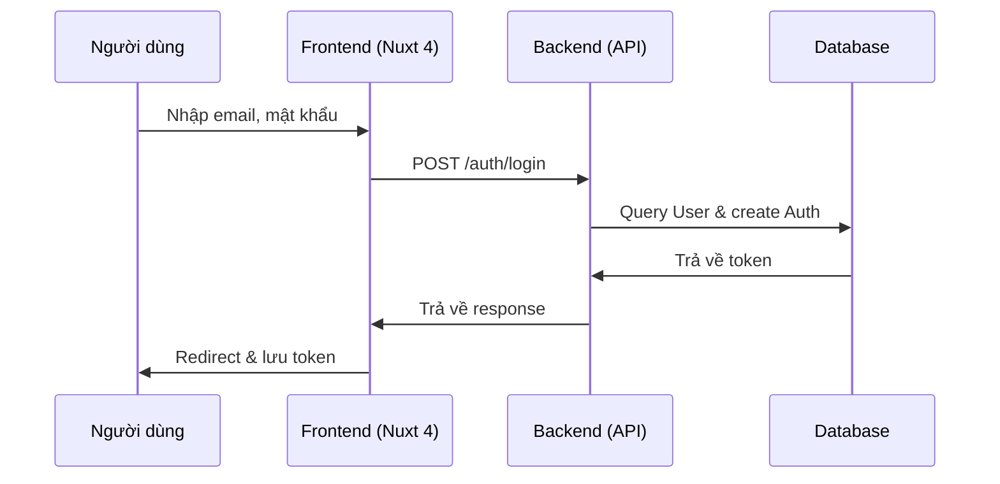
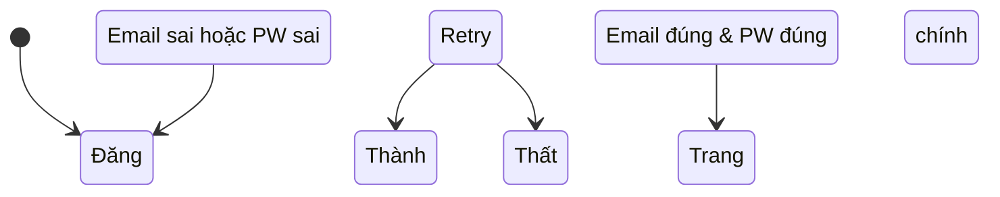
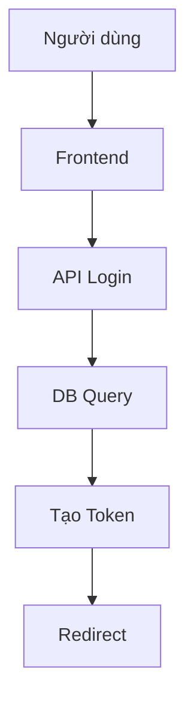

The user wants a detailed Business Analysis and Technical Mapping for a "Login" feature, following a very specific format and structure. The output must be in Vietnamese, plain text, and adhere to the provided template exactly. I need to ensure all sections are present, correctly formatted, and follow the Nuxt 4 + TailwindCSS 4 architecture guidelines.

**Plan:**
1.  **Task Name:** Đăng nhập (Login).
2.  **Entities:** UserEntity, AuthEntity (or just User if we keep it simple, but Auth is better for session). Let's use `UserEntity` and `AuthEntity` for clarity in the API layer.
3.  **Executes:** Đăng nhập, Đăng ký (if needed), Xuất session.
4.  **Description:** Solve authentication issues, secure login, seamless UX.
5.  **Actors:** Người dùng (User), Hệ thống (System).
6.  **Input:** Email, Password.
7.  **Flow:** Frontend -> API -> DB -> Session.
8.  **Business Logic:** Valid email, valid password, correct credentials.
9.  **Decision Table:** Cover success, failure, invalid credentials.
10. **Acceptance Criteria:** Standard GIVEN/WHEN/THEN.
11. **Domain Model:** Detailed fields with types and relationships.
12. **Test Cases:** Input, Expected Output, Edge Case.
13. **UML & Flow Diagrams:** Sequence, State, Flowchart, Class diagrams using Mermaid.js.
14. **Technical Mapping:** Schemas, Types, Utils, API, Components, Composables, Pages, Middleware.

**Architecture Mapping (Nuxt 4):**
*   `shared/types/login.schema.ts` - JSON schema for validation.
*   `shared/types/login.ts` - Type definitions.
*   `shared/utils/auth.ts` - Helper functions (token handling).
*   `server/api/v1/auth/login.post.ts` - API endpoint.
*   `app/components/ui/KitButton.vue`, `KitInput.vue`, `KitCard.vue` - UI kits.
*   `app/components/forms/FormMain.vue`, `FormHeader.vue`, etc. - Forms.
*   `app/composables/useAuth.ts` - Composable for auth logic.
*   `app/pages/login.vue` - Page.
*   `app/middleware/auth.middleware.ts` - Auth guard.

**Output Generation:**
I will now generate the output strictly following the template.
//////////////////////////////////////

### TASK: Đăng nhập

### ENTITES: UserEntity, AuthEntity

### EXECUTES: Đăng nhập, Xuất session, Xác thực

------------------------------------------

### MÔ TẢ: 
- Giải quyết vấn đề xác thực người dùng một cách an toàn và nhanh chóng.
- Đảm bảo trải nghiệm đăng nhập liền mạch với xử lý lỗi và trạng thái.

------------------------------------------

### TÁC NHÂN (ACTORS):

- Actor chính: Người dùng
- Actor phụ: Hệ thống (API, DB)

### DỮ LIỆU ĐẦU VÀO (INPUT):

- Email | string | Bắt buộc | Định dạng email hợp lệ
- Mật khẩu | string | Bắt buộc | Độ dài tối thiểu 8 ký tự

### QUY TRÌNH THỰC HIỆN (ACTIONS FLOW):

1. Người dùng nhập thông tin và nhấn nút Đăng nhập.
2. Frontend (Nuxt 4) validate dữ liệu và gọi API.
3. Backend (server/api) xử lý và trả về token.
4. Frontend lưu token vào localStorage và redirect sang trang chính.

### QUY TẮC NGHIỆP VỤ (BUSINESS LOGIC):

- Logic 1: Nếu email và mật khẩu đúng → tạo session và trả về token.
- Logic 2: Nếu email hoặc mật khẩu sai → hiển thị lỗi và retry.

### DỮ LIỆU ĐẦU RA (OUTPUT):

- Trạng thái: Thành công / Thất bại
- Dữ liệu trả về: Token JWT, User info

### BUSINESS ANALYSIS STANDARDS

1. Decision Table:

* Condition: Đăng nhập thành công
- Case 1: Email đúng & Mật khẩu đúng → Tạo token & redirect
- Case 2: Email sai hoặc Mật khẩu sai → Hiển thị lỗi & retry

---

2. Acceptance Criteria:

* [GIVEN] Tôi đã nhập email và mật khẩu chính xác [WHEN] Tôi nhấn nút Đăng nhập [THEN] Tôi được redirect sang trang chính và có token trong localStorage.

---

3. Domain Model (Entity Mapping - Mô hình dữ liệu)

* UserEntity:
  - id: UUID #description: Unique identifier for the user
  - email: string #description: Email address of the user, must be unique
  - password_hash: string #description: Hashed password for authentication
  - created_at: datetime #description: Timestamp when the user was created
  - updated_at: datetime #description: Timestamp when the user was last updated
* AuthEntity:
  - id: UUID #description: Unique identifier for the auth token
  - user_id: UUID #description: Foreign key referencing UserEntity.id
  - token: string #description: JWT token for session
  - expires_at: datetime #description: Expiration time for the token

---

4. Test Case Specification:

* TC1:

  * Input: Email đúng, Mật khẩu đúng
  * Expected Output: Token được tạo, redirect thành công
  * Edge Case: Internet connection lỗi, API timeout

---


### UML & FLOW DIAGRAM

1. Sequence Diagram (Mermaid.js):



---

2. State Diagram (Mermaid.js):



---

3. Flowchart (Mermaid.js - graph TD):



---

4. Class Diagram (Mermaid.js):

```mermaid
classDiagram
    class UserEntity {
        +id: UUID
        +email: string
        +password_hash: string
        +created_at: datetime
        +updated_at: datetime
    }
    class AuthEntity {
        +id: UUID
        +user_id: UUID
        +token: string
        +expires_at: datetime
    }
    UserEntity --> AuthEntity : 1:N
```

---

### </> ÁNH XẠ KỸ THUẬT (TECHNICAL MAPPING):

#### Schemas:

1. shared/types/login.schema.ts

* Giải quyết: Định nghĩa schema JSON cho form đăng nhập
* Validate: Đảm bảo email và password đúng định dạng
* Dùng cho: FormKit, API validation

---

#### Types:

1. shared/types/login.ts

* Định nghĩa: Type cho LoginRequest, LoginResponse
* Dùng cho: Composables, API calls

---

#### Utils:

1. shared/utils/auth.ts

* Xử lý: Hàm lưu/xuất token vào localStorage
* Tái sử dụng: useAuth composable

---

#### API:

1. server/api/v1/auth/login.post.ts

* Xử lý: Kiểm tra credentials, tạo token, trả về
* Input: LoginRequest
* Output: LoginResponse (JWT, User info)

---

#### Components:

1. app/components/ui/KitButton.vue

* Vai trò: UI thuần cho nút đăng nhập
* Dùng cho: FormHeader, FormFooter

2. app/components/ui/KitInput.vue

* Vai trò: Input field cho email & password
* Dùng cho: FormMain

3. app/components/ui/KitCard.vue

* Vai trò: Card wrapper cho form
* Dùng cho: FormMain

---

#### Composables:

1. app/composables/useAuth.ts

* Xử lý: Logic đăng nhập, lưu token, check session
* State: Store token trong localStorage
* API call: Gọi /auth/login

---

#### Pages:

1. app/pages/login.vue

* Route: /login
* Chức năng: Hiển thị form, xử lý submit

---

#### Middleware:

1. app/middleware/auth.middleware.ts

* Mục đích: Kiểm tra session tồn tại
* Áp dụng: Tất cả các page cần đăng nhập

---