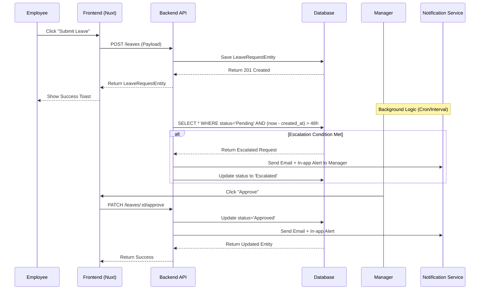
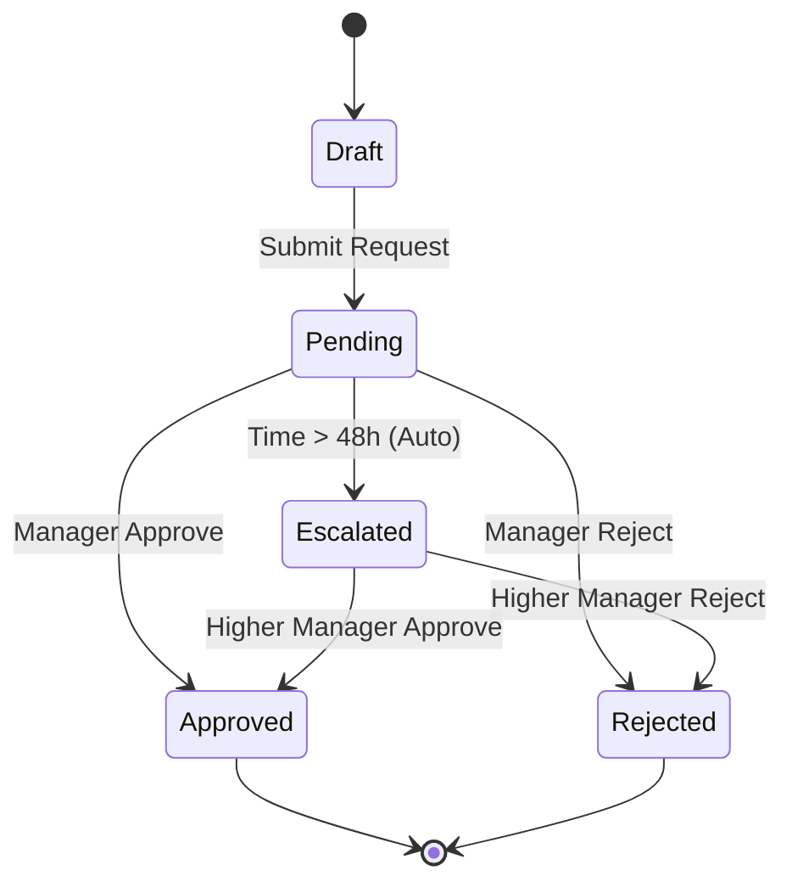
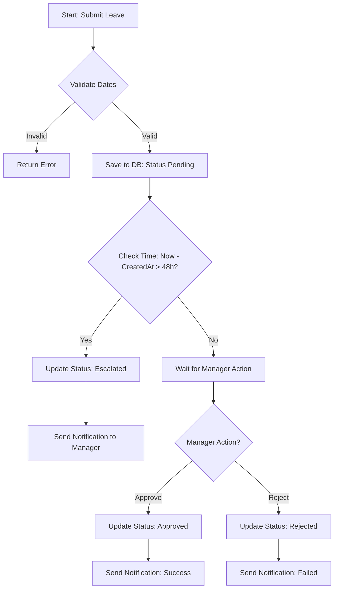
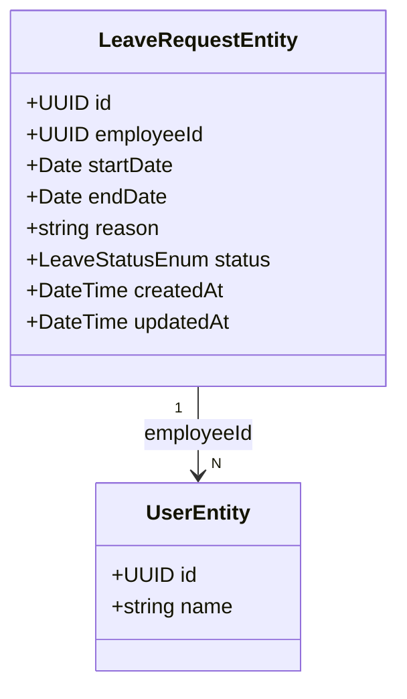

1.  **Analyze the Request:**
    *   **Goal:** Build a leave request approval system for employees.
    *   **Actors:** Employee (Submitter), Manager (Approver/Rejector), System (Logic, Email, Notification).
    *   **Core Actions:** Submit Request, Approve/Reject, Escalate (if > 48h), Notify.
    *   **Constraints:** Nuxt 4 + TailwindCSS 4 + TypeScript Strict.
    *   **Architecture:** Clean architecture, shared folder for schemas/types/utils.

2.  **Business Logic Analysis (The "Brain"):**
    *   *Entities:* LeaveRequestEntity, UserEntity (Employee), UserEntity (Manager).
    *   *States:* Draft -> Pending -> Approved/Rejected/Escalated.
    *   *Escalation Rule:* If `CurrentTime - CreatedTime > 48h` AND `Status == Pending`, move to next level.
    *   *Notifications:* Email + In-app (Toast/Notification).

3.  **Mapping to Nuxt 4 Architecture:**

    *   **Shared (Backend & Frontend Common):**
        *   `LeaveRequestEntity`: Schema for DB.
        *   `LeaveRequestStatusEnum`: Type for state machine.
        *   `LeaveTypeSchema`: Type for leave details (days, type).
        *   `NotificationSchema`: Type for email/in-app alerts.

    *   **Server (API):**
        *   `POST /api/v1/leaves`: Create request.
        *   `PATCH /api/v1/leaves/:id/approve`: Manager action.
        *   `PATCH /api/v1/leaves/:id/reject`: Manager action.
        *   `GET /api/v1/leaves`: List requests.

    *   **Frontend (App):**
        *   **Composables:** `useLeaveManager` (handle logic, API calls), `useNotification` (handle UI alerts).
        *   **Components:**
            *   `KitForm.vue` (for input).
            *   `LeaveRequestCard.vue` (display list).
            *   `LeaveApprovalModal.vue` (approve/reject popup).
        *   **Pages:** `pages/leaves/index.vue` (list), `pages/leaves/create.vue` (form).

4.  **Drafting the Output Structure:**

    *   **TASK:** Leave Request Approval System.
    *   **ENTITIES:** LeaveRequestEntity, UserEntity.
    *   **EXECUTES:** SubmitLeave, ApproveLeave, RejectLeave, EscalateLeave.

    *   **UML & Flow Diagrams:**
        *   *Sequence:* Employee -> API -> DB -> Manager -> API -> DB -> Email.
        *   *State:* Draft -> Pending -> Approved/Rejected/Escalated.
        *   *Flowchart:* Start -> Submit -> Check Time -> Approve/Reject.

    *   **Business Analysis Standards:**
        *   *Decision Table:* Status changes based on time and action.
        *   *Acceptance Criteria:* Given valid data, when submit, then success. Given pending > 48h, when check, then escalate.
        *   *Domain Model:* Fields for `startDate`, `endDate`, `reason`, `status`, `escalationLevel`.

    *   **Technical Mapping:**
        *   Schemas/Types in `/shared`.
        *   API endpoints in `/server`.
        *   Components in `/app/components`.

5.  **Refining the Logic (Self-Correction):**
    *   *Escalation:* Needs a cron job or a polling mechanism? The prompt says "automatically push up". In a real app, this is usually a background job (server-side). I will define the API endpoint for checking escalation, but the actual trigger might be a scheduled task. For this BA analysis, I'll focus on the logic flow.
    *   *Notification:* Needs to be decoupled. `useNotification` composable.

6.  **Writing the Content (in Vietnamese):**

    *   *Task Definition:* Leave Request Approval System.
    *   *Entities:* LeaveRequestEntity, UserEntity.
    *   *Actions:* SubmitLeave, ApproveLeave, RejectLeave, EscalateLeave.

    *   *UML:*
        *   Sequence Diagram: Employee -> Frontend -> API -> DB. Manager -> Frontend -> API -> DB. System (Background) -> DB.
        *   State Diagram: Draft -> Pending -> Approved/Rejected/Escalated.
        *   Flowchart: Start -> Submit -> Check Time > 48h? Yes/No.

    *   *Business Logic:*
        *   Logic 1: If status is Pending and (Now - CreatedAt) > 48h, set status to Escalated.
        *   Logic 2: Manager approves -> Status = Approved. Reject -> Status = Rejected.

    *   *Technical Mapping:*
        *   `LeaveRequestSchema` (shared).
        *   `LeaveRequestStatusEnum` (shared).
        *   `useLeaveStore` (composable).
        *   `LeaveForm.vue` (component).

7.  **Final Review against Constraints:**
    *   Nuxt 4? Yes.
    *   TailwindCSS 4? Yes.
    *   Strict TS? Yes.
    *   Folder structure correct? Yes (`shared`, `app/components`, etc.).
    *   No rambling? Keep it concise.

8.  **Constructing the Final Output:** (Proceeding to generate the text based on the template).//////////////////////////////////////

### TASK: Hệ thống phê duyệt nghỉ phép (Leave Approval System)

### ENTITIES: LeaveRequestEntity, UserEntity

### EXECUTES: SubmitLeave, ApproveLeave, RejectLeave, CheckEscalation

------------------------------------------

### MÔ TẢ:
- Giải quyết vấn đề quản lý thời gian nghỉ phép tự động tăng cấp.
- Giải quyết vấn đề thông báo đa kênh (Email + App).
- Giải quyết vấn đề trạng thái chuyển đổi (State Machine).

------------------------------------------

### TÁC NHÂN (ACTORS):
- Actor chính: Employee (Người gửi), Manager (Người duyệt).
- Actor phụ: System (Scheduler/Background Job).

### DỮ LIỆU ĐẦU VÀO (INPUT):
- Tên trường | Kiểu dữ liệu | Bắt buộc | Ghi chú
- startDate | Date | Yes | Ngày bắt đầu nghỉ
- endDate | Date | Yes | Ngày kết thúc nghỉ
- reason | string | Yes | Lý do nghỉ
- typeLeaveId | UUID | Yes | Loại nghỉ phép

### QUY TẮC NGHIỆP VỤ (BUSINESS LOGIC):
- Logic 1: Nếu `status` là `Pending` và `(CurrentTime - createdAt) > 48h`, tự động chuyển trạng thái sang `Escalated`.
- Logic 2: Khi Manager duyệt thành công, gửi thông báo Email + In-app.
- Logic 3: Khi Manager từ chối, gửi thông báo Email + In-app.

------------------------------------------

### DỮ LIỆU ĐẦU RA (OUTPUT):
- Trạng thái: Thành công / Thất bại
- Dữ liệu trả về: LeaveRequestEntity (cập nhật trạng thái)

------------------------------------------

### BUSINESS ANALYSIS STANDARDS

1. Decision Table:

* Condition: Status & Time Elapsed
- Case 1: Pending & > 48h → Escalated
- Case 2: Pending & <= 48h → Remains Pending
- Case 3: Approved/Rejected/Escalated → No Change

---

2. Acceptance Criteria:

* [GIVEN] Employee submits valid leave request
* [WHEN] Request is saved to DB
* [THEN] Status is 'Pending' and createdAt is recorded.

* [GIVEN] Leave request is 'Pending' for 48 hours
* [WHEN] System checks logic
* [THEN] Status changes to 'Escalated' and notification sent.

---

3. Domain Model (Entity Mapping - Mô hình dữ liệu)

* LeaveRequestEntity:
  - id: UUID # Primary Key, Unique
  - employeeId: UUID # FK → UserEntity.id, Who requested
  - startDate: Date # Start date of leave
  - endDate: Date # End date of leave
  - reason: string # Reason for leave, Max length 500
  - status: LeaveStatusEnum # Enum: Pending, Approved, Rejected, Escalated
  - createdAt: DateTime # When request created
  - updatedAt: DateTime # Last update time (for escalation check)
  - escalatedTo: UUID # FK → UserEntity.id (Next level manager)
  - Relationship: Employee (1) → LeaveRequest (N)

---

4. Test Case Specification:

* TC1: Submit Request
  * Input: { startDate, endDate, reason }
  * Expected Output: Status = Pending, createdAt = Now
  * Edge Case: Dates overlap with existing approved leave.

---

### UML & FLOW DIAGRAM

1. Sequence Diagram (Mermaid.js):

2. State Diagram (Mermaid.js):

3. Flowchart (Mermaid.js - graph TD):

4. Class Diagram (Mermaid.js):

------------------------------------------

### </> ÁNH XẠ KỸ THUẬT (TECHNICAL MAPPING):

#### Schemas:

1. shared/types/leave.schema.ts

* Giải quyết: Định nghĩa cấu trúc dữ liệu cho request và response.
* Validate: Kiểm tra startDate < endDate, duration <= maxDays.
* Dùng cho: Frontend Form & Backend API.

---

#### Types:

1. shared/types/enums.ts

* Định nghĩa: `LeaveStatusEnum` ('Pending', 'Approved', 'Rejected', 'Escalated').
* Dùng cho: Type checking trong TypeScript và Database Schema.

---

#### Utils:

1. shared/utils/date.utils.ts

* Xử lý: Tính toán thời gian chênh (diff in hours).
* Tái sử dụng: Logic `isOver48Hours`.

---

#### API:

1. server/api/v1/leaves/index.ts

* Xử lý: GET /list, POST /create.
* Input: LeaveRequestSchema.
* Output: LeaveRequestEntity.

2. server/api/v1/leaves/[id].ts

* Xử lý: PATCH /approve, PATCH /reject.
* Input: UUID id.
* Output: LeaveRequestEntity.

---

#### Components:

1. app/components/ui/KitForm.vue

* Vai trò: UI thuần
* Dùng cho: Form nhập ngày nghỉ, lý do.

2. app/components/business/LeaveCard.vue

* Vai trò: Business UI
* Xử lý: Hiển thị thông tin đơn, badge trạng thái (Pending/Approved), nút hành động (Approve/Reject).

3. app/components/business/LeaveApprovalModal.vue

* Vai trò: Business UI
* Xử lý: Popup xác nhận duyệt hoặc từ chối.

---

#### Composables:

1. app/composables/useLeaveStore.ts

* Xử lý: State management cho danh sách đơn.
* API call: fetchLeaves, submitLeave, approveLeave, rejectLeave.
* State: `leaves` array, `loading` boolean.

2. app/composables/useNotification.ts

* Xử lý: Hiển thị Toast (In-app).
* API call: Gửi email (mock hoặc integration).

---

#### Pages:

1. app/pages/leaves/index.vue

* Route: /leaves
* Chức năng: Danh sách đơn của nhân viên + nút "Đăng ký nghỉ".

2. app/pages/leaves/create.vue

* Route: /leaves/create
* Chức năng: Form đăng ký mới.

---